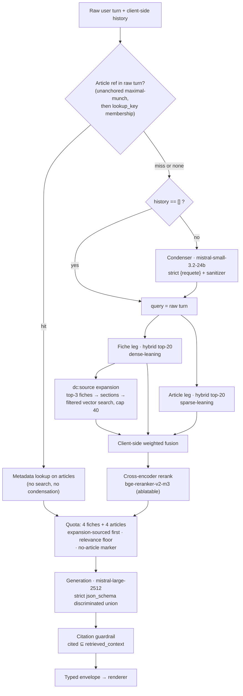

# rag_assurances — Specification

**A French-language RAG assistant over public French insurance law.**

Status: **decisions closed, build not started.** This document is the output of the
wayfinding map [#1](https://github.com/Zameloth/rag_assurances/issues/1) and its sixteen
decision tickets. Every design question that had to be settled before building is settled
here; what remains genuinely open is listed in [§17](#17-open-questions).

Each section states *what to build*. The *why* lives in the linked ticket, and the
architectural summary in [`docs/adr/`](docs/adr/). Where a decision was reversed or
corrected by a later ticket, this document records only the final state.

---

## Contents

1. [Purpose and scope](#1-purpose-and-scope)
2. [Architecture](#2-architecture)
3. [Corpus](#3-corpus)
4. [Ingestion and chunking](#4-ingestion-and-chunking)
5. [Embeddings](#5-embeddings)
6. [Vector store](#6-vector-store)
7. [Payload manifest](#7-payload-manifest)
8. [Query condensation](#8-query-condensation)
9. [Retrieval](#9-retrieval)
10. [Generation](#10-generation)
11. [Observability](#11-observability)
12. [Evaluation](#12-evaluation)
13. [Application](#13-application)
14. [Deployment](#14-deployment)
15. [Index delivery and operations](#15-index-delivery-and-operations)
16. [Repository layout, configuration and licensing](#16-repository-layout-configuration-and-licensing)
17. [Open questions](#17-open-questions)
18. [Recorded limitations](#18-recorded-limitations)
19. [Rejected alternatives](#19-rejected-alternatives)
20. [Build order](#20-build-order)
21. [Decision index](#21-decision-index)

---

## 1. Purpose and scope

### 1.1 The user and the question register

A **curious consumer** trying to understand French insurance — *"comment marche la
franchise ?"*, *"quel est le délai de renonciation ?"*. Not a professional
(courtier/gestionnaire), and never someone asking what their own contract covers.

Questions arrive in **consumer French**; the authoritative answer lives in **legal
French**. Bridging those two registers *is* the system — it is the retrieval problem the
whole stack exists to solve.

Interaction is **multi-turn**: follow-ups like *"et si je suis locataire ?"* must work.

### 1.2 Corpus scope — a rule, not a list

> In scope = any service-public.fr insurance fiche whose `<dc:source>` resolves into the
> Code des assurances, plus the in-force Code des assurances itself.

The rule is mechanical and reproducible, and it guarantees that **every consumer document
in the corpus has a legal counterpart in-corpus**. It keeps auto (`N32`), habitation
(`N44`) and vie (`N89`); it drops pure *assurance maladie* (`N31348`/`N423`/`N31750`),
whose fiches rest on the Code de la sécurité sociale and would be structurally ungrounded.

### 1.3 The answer contract — two parts

1. **Explanation** in consumer French, grounded in the fiche.
2. **Fondement juridique** — the Code des assurances article(s) behind it, cited, where
   one exists.

This makes the two-register architecture visible in the output, and gives evaluation two
independently measurable things instead of one fuzzy blob.

### 1.4 The refusal line — recommendation, not personalisation

The regulated act under the *devoir de conseil* regime (ACPR **2024-R-03**) and the
intermédiation rules is **recommending a product or a course of action** — not explaining
which rule applies to whom.

The assistant **answers** situational questions — *"si vous êtes locataire, l'article L…
s'applique"*. This exploits the `<Cas>`/`<Situation>` conditional branches of the corpus
and is the single capability the use case calls distinctive. Refusing them would throw
away the corpus's best feature.

The assistant **refuses** three classes, and refusals still answer the informational part
of the question:

| Class | `motif` | Example |
|---|---|---|
| Product / insurer recommendation | `recommandation_produit` | *"quelle assurance auto choisir ?"* |
| Course-of-action advice | `conseil_action` | *"dois-je accepter cette indemnisation ?"* |
| Out of corpus | `hors_corpus` | sécurité sociale, other jurisdictions, tax |

A standing **« information, pas conseil »** disclaimer accompanies answers. It is
**app-rendered boilerplate**, never generated per call.

### 1.5 Project posture

Solo learning / portfolio project, deployed publicly. Decisions are optimised for learning
value and iteration speed over production hardening. **Eval is the differentiator** — the
system must be measurable, not vibes, and that is why Langfuse is in the stack.

### 1.6 Out of scope

- **Contract-grounded Q&A** and insurer *conditions générales* (Tier 3). Not the use case;
  also not redistributable (MAIF forbids it in writing, AXA is silent). Drops the TDM-exception
  legal question with it — nothing in the corpus needs CPI art. L122-5-3 III.
- **ACPR publications as corpus** (Tier 2). ACPR 2024-R-03 is a *system-prompt input* that
  fixes where the explain/advise line falls; it is never an indexed document.
- **Historical article versions.** In-force only. A curious consumer wants today's law.
- **Auth, user accounts, multi-tenancy.** No users but the author.
- **Production compliance review** (RGPD, ACPR obligations).
- **Deep interface design** and **deep infra design** (CI pipelines, IaC, secrets rigor).

---

## 2. Architecture



Three standing constraints on every component:

1. **The pipeline is an importable library.** `compare.py` and the web app share one code
   path; the app adds no logic of its own. A UI-embedded pipeline means the evaluated
   system and the served system can drift.
2. **The chain returns a fat object**, not just an answer — final contexts, per-leg
   candidate pools, refusal type, citation-check outcome, condenser fields. Langfuse
   evaluators see only the task's return value, never the trace, so anything missing here
   is unmeasurable.
3. **The app is stateless.** History is client-side and posted back each turn.

---

## 3. Corpus

### 3.1 Composition

| Register | Source | Volume | Licence |
|---|---|---|---|
| `fiches` | service-public.fr insurance fiches (`vosdroits-latest.zip`) | **87 documents** — 42 *Fiche d'information conditionnée*, 45 *Fiche Question-réponse conditionnée* | Licence Ouverte 2.0 |
| `articles` | Code des assurances, in force | **2,377 articles** (L 937 / R 1,142 / A 246 / D 52) | Licence Ouverte 2.0 |

The 87 fiches are the result of applying §1.2's rule concretely: each fiche's `<dc:source>`
`LEGISCTA` ids intersected with the **556 distinct `sectionParentId` values** across the
2,377 in-force articles.

### 3.2 What ships in git

**Principle: the repo commits sources and decisions, never derived binaries.**

The *filtered* Tier-1 document set is **pinned in git**. This is not a licence or size
decision — it is forced by reproducibility. `vosdroits-latest.zip` is a `-latest` URL
refreshed daily with **no version to pin**, so fetch-at-build is not reproducible at all on
the fiche side. Git is the only available pin, and the hand-annotated golden set and the
paired six-rung ladder both break silently if the corpus can move on its own: a rung-4-vs-rung-3
comparison run a week apart would be a cross-corpus comparison wearing the costume of an
ablation, invisible in the numbers.

| Path | Form | Why |
|---|---|---|
| `data/corpus/fiches/F*.xml` | **verbatim DILA XML**, one file per fiche, original filenames | `<Chapitre>`/`<SousChapitre>`/`<Cas>` are §4's option space and `cas_label`'s only source. Parsing here would answer §4 by accident. Original filenames satisfy LO 2.0's "filename and date" condition by construction. |
| `data/corpus/articles.jsonl` | JSONL, one object per line, **sorted by `cid`** | No structure to protect; the field set is fixed. **JSONL not parquet** — binary does not diff and would silently defeat the refresh review. |
| `data/corpus/corpus_manifest.json` | script-emitted | Licence record **and** provenance pin (§16.4) |
| `data/corpus/LICENSE.md` | Licence Ouverte 2.0 | Data licence, split from the code licence |

**`articles.jsonl` must carry `texteHtml`, not only `texte`.** `texte` contains **zero
newlines** corpus-wide, so paragraph structure exists only in the HTML — and it is the sole
basis for splitting the 12% of over-band articles. Without it the pinned corpus reproduces
its own *text* but not its own *points*, which is the level the ladder compares at.
Extracted plain text from `texteHtml` is identical to `texte` (difflib 1.000 across a
48-article sample), so this adds a field, not a discrepancy.

**Gitignored, in `data/raw/`:** `vosdroits-latest.zip` and its 141 MB extraction, the
downloaded parquet, the HF model cache (~2.3 GB per model). All re-fetchable and verifiable
against the manifest `sha256`.

### 3.3 Corpus refresh

The fetch script is a **dev tool run by hand**, never a pipeline stage. Nothing in the
build path makes a network call to DILA; ingest reads from git. Refresh is a **manual,
reviewed commit**.

A refresh **must report three counts**: added / removed / **changed-text-under-the-same-`cid`**.
The third is the dangerous one — **52% of Code articles have been amended at least once**,
so a refresh is *expected* to invalidate some hand-annotated gold labels. That is the price
of freshness, not a bug; what makes it survivable is finding out at refresh time rather
than as an unexplained dip in a ladder rung three weeks later.

**Ingest assertion 5 (§7.4) gates the refresh, not only the ingest.**

Scheduled or automatic refresh is **rejected** — it lets the corpus change *between* two
rungs of the ladder, the exact failure git-pinning exists to prevent.

---

## 4. Ingestion and chunking

**512-token band (BGE-M3 tokenizer) · recursive structural descent · no overlap · one
shared chunk population across every ladder rung and both embedder arms.**

The shared population is forced, not merely convenient: rung 6 must change exactly one
variable, per-arm chunking would un-share the point ids the gold labels depend on, and
sizing to BGE-M3's 8192 window would make `multilingual-e5-large-instruct` silently
truncate 12% of articles — the rung would then measure "embedder + data loss", with nothing
in the numbers to show it.

Measured corpus shape, for reference: article median **167 tokens** (p90 582, p95 814);
289 articles (**12.2%**) over 512; exactly **1** over 8192. Fiche `<Chapitre>` median **169**.
BGE-M3's 8192 window is essentially never used on this corpus.

### 4.1 Fiches

**Body is four elements of 38**: `<Introduction>`, `<Texte>`, `<Conclusion>`,
`<ListeSituations>`. The other 34 — `Reference`, `Definition`, `QuestionReponse`,
`PourEnSavoirPlus`, `QuiPeutMAider`, `DossierPere` sibling menus, `FilDAriane` — are
navigation and cross-reference. Dropping them **halves the fiche** (median 2,199 → 1,203
tokens). A chunker that `itertext()`s the file embeds navigation menus as retrievable
content.

**`<ListeSituations>` is a body element despite its name.** All 8 fiches lacking `<Texte>`
carry one instead; word overlap with `<Texte>` where both appear is 0.00–0.06; it holds
**41,251 tokens, 26% of all indexed fiche text**. Excluding it would index **8 of 87 fiches
with zero body content**, surfacing only as an unexplained dip in fiche recall.

**Algorithm:**

1. Emit a node whole if it fits the 512-token band.
2. Otherwise descend into its content children.
3. Sentence-split only if an atomic node still exceeds the band.
4. Merge adjacent siblings while under a **100-token floor**, **never across a
   `<Chapitre>` / `<SousChapitre>` / `<Cas>` boundary** — so `cas_label` is never ambiguous.

Descent is chosen over "pick a tag" for its degenerate cases, not its typical one (both
produce ~identical output: 950 vs 961 chunks). It handles the **18 Chapitre-less fiches**,
and nesting that runs **both ways** — 57 `<Chapitre>` contain a `<Cas>`, but 11 `<Cas>`
contain a `<Chapitre>`, so there is no fixed hierarchy to hard-code.

**The floor is 100 because the context quota is fixed at 4 fiche slots**, which makes chunk
size the dial on how much consumer-French reaches the prompt. 100 lands the fiche median
(137) near the article median (187): weighted per-leg fusion and a shared cross-encoder both
degrade when the two legs' units differ in scale. Pure structure was rejected on its 44%
sub-64-token tail; coarser floors drift the fiche leg into the long-document regime where
sparse beats dense, and the fiche leg is dense-leaning.

**`<Definition>` is excluded** — 284 instances, 150 unique, 6,419 deduped tokens of consumer
glossary. The defined terms already appear in indexed body prose; a definition shared by
five fiches has no sensible `gold_fiches` host and no natural `fiche_id` for point identity;
and some entries are grounded in other codes, outside §1.2's scope rule. Against a fixed
4-slot quota, 150 39-token tooltips would displace procedural and situational content.

### 4.2 Articles

1. One article = one point where it fits the band.
2. Otherwise split on **`texteHtml` blocks** (`<p>` / `<br>` / `<li>` / `<tr>`) packed to
   the band, with sentence-split fallback.
3. **`<table>` content is stripped** during HTML parsing; everything else is kept.
4. Where prose falls under **32 tokens** after stripping, emit a **stub point**:
   `citation_id` + title + a `table non indexée` marker + the Légifrance URL.

Splitting on `texteHtml` is not a preference — `texte` has no newlines and a recursive
character splitter has nothing to split on below the sentence. `<p>` is present in 283 of
the 289 over-band articles. The measured comparison:

| scheme | chunks | median | max | over band |
|---|---|---|---|---|
| **`texteHtml` blocks packed to band** | 2,860 | 193 | **512** | **0** |
| sentence-split `texte` | 2,794 | 183 | 27,221 | 2 |
| legal-marker (`I.-`, `1°`) | 4,393 | 102 | 27,221 | 2, and 34% under 64 tok |

The `<table>` rule is structural because **the 21 annexes are two distinct populations**:
prose annexes carrying **18,465 tokens** of standard-form policy wordings (`A121-1` *is*
the standard auto contract — among the most consumer-relevant prose in the Code), against
**29,902 tokens** of numeric table dominated by `Annexe à l'article A132-18-1`, a
1900-cohort mortality table that is 91% digits and punctuation. Excluding annexes wholesale
would discard the first to remove the second. Stripping tables costs **268 tokens across 4
ordinary articles** — tables are almost entirely an annexe phenomenon. **7** annexes fall
under the 32-token floor and get stub points, so they stay retrievable and citable rather
than silently vanishing from a corpus that claims to be the in-force Code.

### 4.3 No overlap

Overlap exists to repair arbitrary cuts, and there are almost none: **0 of 882 fiche chunks**
and **5 of 2,805 article chunks (0.2%)** come from an arbitrary cut, because only **2 HTML
blocks in the entire corpus** exceed 512 tokens on their own. Essentially every chunk ends
at a boundary a DILA editor put there. Overlap would duplicate text into the index, inflate
the cross-encoder's work on every eval query, and let near-duplicates consume slots in the
fixed 4+4 quota.

### 4.4 Measured output

| collection | points | median tok | mean | p90 | max | < 64 tok |
|---|---|---|---|---|---|---|
| `articles` | **2,805** | 187 | 225 | 472 | 512 | 14% |
| `fiches` | **882** | 137 | 178 | 367 | 511 | 11% |
| **total** | **3,687** | | | | | |

`cas_label` on 98 fiche chunks · 7 stub points · header enrichment 16% of enriched text ·
**15.1 MB** of 1024-dim fp32 dense vectors (11.5 MB `articles`, 3.6 MB `fiches`).

### 4.5 Ingest assertions

Assertions 1–5 are in §7.4. Chunking adds four:

6. Every fiche yields ≥ 1 chunk — catches the `<ListeSituations>` class of bug, where an
   element reclassified as navigation silently empties a document.
7. No chunk exceeds 512 tokens under the BGE-M3 tokenizer.
8. Every non-stub chunk has ≥ 32 tokens of text.
9. `sum(chunk tokens)` per document is within tolerance of the source body token count
   minus stripped `<table>` content — catches silent content loss from an XML or HTML shape
   DILA adds later.

---

## 5. Embeddings

**Default: `BAAI/bge-m3`.** MIT, ~568M params, 1024-dim, 8192-token window, CPU-viable,
ONNX published — and the only candidate emitting **dense + sparse + ColBERT from one
forward pass**, which makes hybrid retrieval a config change rather than a re-embed.

**Runner-up, ablated at rung 6: `intfloat/multilingual-e5-large-instruct`.** Because e5
emits **no sparse vectors**, rung 6's arm must be **e5-dense + M3-sparse**; running e5
alone would change two variables and silently un-do rung 2.

**ColBERT is not stored and not used.** On the M3 paper's own French numbers, MLDR-fr
dense+sparse **84.2** vs all-three **83.9** — late interaction over the same encoder
*subtracts*. Storing ~1 vector per token would also dwarf everything else in the collection.

**Calibrate expectations downward.** The best open local model reaches **~25 nDCG@10 on
BSARD** (legal French) against 82–88 on general French; even BSARD's own fine-tuned dense
baseline only hit 74.8% R@100. **The retrieval stack has to do the work here, not the
embedder** — which is why §9 exists in the shape it does.

**French-specific ≠ legal-capable.** `Solon-embeddings-large-0.1`, the obvious "it's the
French one" pick, scores BSARD nDCG@10 **2.08** / R@100 12.61 while scoring fine on general
French. This warning is about **embedders**, which must *find* legal text by similarity; it
does **not** transfer to generation, which never performs that hop.

Ruled out: CamemBERT-derived (`max_seq_length: 128`, STS-tuned), `mistral-embed` (still
version 23.12, no traceable French number), `jina-embeddings-v3` (CC-BY-NC-4.0, a
non-commercial licence in a public portfolio repo), `bge-multilingual-gemma2` (best French
numbers measured, but 9B and not CPU-viable).

---

## 6. Vector store

**Qdrant, as a Docker service in dev and on the VPS alike, driven through the native client
behind one custom `BaseRetriever`.**

### 6.1 The store is a query engine, not a `VectorStore`

Every high-level hybrid helper on offer — `langchain-qdrant`'s `RetrievalMode.HYBRID`,
`langchain-chroma`'s `hybrid_search` — **fuses for you**, which is precisely what §9's
per-leg weighting forbids. Accepting server-side RRF would silently discard the
MIRACL/MLDR evidence the design turns on, and make rung 2 untestable.

So: raw `qdrant-client` queries, wrapped in a single `BaseRetriever` subclass whose
`_get_relevant_documents` issues the per-leg queries and does the weighted fusion itself.
**The wrapper is the point** — retrieval stays a LangChain component, so Langfuse's
auto-tracing still sees a retriever span and the pipeline still composes into a chain.
"LangChain integration maturity" is therefore not a store-selection criterion; what matters
is what the *native* client accepts.

### 6.2 Why Qdrant

The bar was never "supports sparse" — it is **accepts BGE-M3's learned lexical weights as
raw indices and values**. A store that can only generate its own sparse vectors doesn't
satisfy the requirement, it silently overrides the decision.

| store | sparse | verdict |
|---|---|---|
| **Qdrant** | named sparse vectors, raw indices + values | **chosen** |
| Milvus | `SPARSE_FLOAT_VECTOR`, IP metric only | viable — lost on footprint (16 GB recommended, 3 compose services) |
| Chroma | shipped Nov 2025, but bound to *its own* embedding fns; no documented raw indices/values path | out |
| LanceDB | dense + BM25 FTS only | out |
| pgvector | `sparsevec` exists, but HNSW caps at 1,000 non-zeros — and M3-sparse non-zeros ≈ unique subword tokens, which a long article clears | out |

The VPS breaks the Qdrant/Milvus tie on **RAM**, and the reason is not the datastore:
BGE-M3 and the cross-encoder are co-resident on the same box, so every megabyte the store
takes is taken from the models. Qdrant is a single Rust binary at ~135 MB per million
vectors — our 3,687 points are a rounding error.

### 6.3 Server everywhere, exact search always

**`optimizers_config=OptimizersConfigDiff(indexing_threshold=0)`** on every collection.

Qdrant's default `indexing_threshold_kb: 10000` builds HNSW once a collection exceeds ~10 MB
of vectors. At 1024-dim fp32 (4 KB/vector) that threshold sits at ~2,500 points — and our
two collections **straddle it**: `articles` at 11.5 MB, `fiches` at 3.6 MB. Without the
override, the two legs of a single query would run **different search algorithms as a side
effect of collection size**, inside a ladder built to attribute each delta to one variable.
The same override also removes the embedded-vs-server version of the same trap.

`QdrantClient(":memory:")` is retained **for the pytest suite only** — local mode is a pure-Python
reimplementation, not the Rust engine, and its parity gap is irrelevant where the assertions
are on plumbing rather than recall.

Re-enabling HNSW later is its own clean experiment: *what does approximate search cost us
in recall?*

### 6.4 Collections, aliases and point ids

**Two collections, `fiches` and `articles`**, not one collection with a `register` field.
The two registers get materially different treatment — different dense/sparse weights,
separate candidate pools, separate recall metrics, separate quota slots — and two
collections make that topology literal: the expansion path and the article short-circuit
become plain filtered lookups with no possibility of a fiche leaking in.

**Ablation arms are real collections behind stable aliases.** Arms are named per
configuration (`articles__m3__c512__v1`, and per §15.5 `<register>__<release-tag>` in prod);
the retriever always reads through the aliases `fiches` / `articles`. Switching arms is an
alias update, so **no experiment or application code ever hardcodes an arm name**, and
rolling back is instant.

**Dense + sparse as two named vectors on the same point.** M3 emits both from one forward
pass; one point keeps them in lockstep by construction rather than by join.

**Point ids are UUIDv5** over a fixed namespace plus the natural key:

```
articles: uuid5(NS, f"{legiarti_cid}#{chunk_index}")
fiches:   uuid5(NS, f"{fiche_id}#{chunk_index}")
```

Qdrant accepts only unsigned 64-bit integers or UUIDs, so `LEGIARTI…`/fiche-id strings
cannot be point ids directly. Two payoffs: **idempotent ingestion** (re-running is an upsert
that overwrites in place, not a second copy of the corpus), and **ids computable from the
source document without querying the store**, which is what lets the golden set label ground
truth by natural ids and have the harness derive point ids deterministically — so gold
labels stay valid across every arm of the ladder.

**The `cid` distinction is load-bearing.** The article side carries two LEGIARTI ids: `id`
(this *version*) and `cid` (the article's *chronicle*, stable across amendments). They
diverge for **1,230 of 2,377 articles (52%)**. Under `id`, an amended article hashes to a
*different point*: the upsert writes a new point and leaves the stale version behind as a
**retrievable orphan** — the precise failure UUIDv5 was chosen to prevent, and silent.
`cid` is the identity; `legiarti_version_id` is retained as payload (§7.3).

`chunk_index` is load-bearing too, not decorative: 289 articles produce 2+ points each.

---

## 7. Payload manifest

**Flat per-chunk payload — document-level metadata duplicated onto every chunk, no separate
document registry.** Sizing is arithmetic (~325 B of doc-level fields × ~882 fiche chunks
≈ 150 KB, ~3% of the chunk text stored anyway). The decisive argument is **ablation-arm
consistency**: an arm is a collection behind an alias, and a registry would sit *outside*
that mechanism — rungs would share one registry file with nothing detecting staleness after
a re-chunk. The usual objection to flat payloads ("changing a field means re-indexing")
does not apply: Qdrant's `set_payload` rewrites payload without touching vectors.

Every field earns its place by serving one of four named consumers: **retrieval**, **the
prompt**, **the app**, **eval**. Anything serving none is decoration.

`text` is **always the raw chunk** — verbatim source text, minus stripped `<table>` content.
Embedding-time enrichment (§12.6) is a transform that is **never stored**, so the prompt and
`gold_spans` always see source text.

### 7.1 `fiches` — point id `uuid5(NS, f"{fiche_id}#{chunk_index}")`

| field | index | consumer |
|---|---|---|
| `fiche_id`, `chunk_index` | — | identity, gold labels |
| `text` (raw) | — | prompt, `gold_spans` |
| `title` | — | prompt, app |
| `chapitre_titre` *(nullable)* | — | prompt (rendered above the chunk) |
| `cas_label` *(nullable)* | — | prompt |
| `section_ids` (list) | — | expansion — **read, never filtered on** |
| `sp_url`, `date_modified` | — | app |
| `fil_ariane`, `type` | — | debug, annotation |

### 7.2 `articles` — point id `uuid5(NS, f"{legiarti_cid}#{chunk_index}")`

| field | index | consumer |
|---|---|---|
| `legiarti_cid`, `chunk_index` | — | identity, gold labels |
| `text` (raw) | — | prompt, `gold_spans` |
| `citation_id` | — | prompt, citation key, `cited ⊆ retrieved_context` |
| **`lookup_key`** *(nullable)* | **keyword** | short-circuit |
| **`section_id`** | **keyword** | expansion (`MatchAny`) |
| `full_sections_titre` | — | prompt (first segment dropped), app |
| `legiarti_version_id` | — | provenance + Légifrance URL |
| `date_debut`, `etat` | — | provenance |

**Exactly two payload indexes.** Everything else is a full scan over ~2,800 points —
microseconds — and RAM is the binding constraint.

### 7.3 The article number is two fields, not one

Measured across all 2,377 in-force articles, the `num` format space is wider than a single
field can serve:

| form | count | example |
|---|---|---|
| plain two-segment | ~1,853 | `L113-3` |
| **three or more segments** | **430 (18%)** | `L113-15-2`; four-segment `L132-9-3-1` |
| **asterisk** (*décret en Conseil d'État*) | **69 (2.9%)** | `R*113-4` |
| no dash at all | 4 | `L500`, `A112` |
| **prose label, not a number** | **21 (0.9%)** | `Annexe à l'article A121-1` |

- **`citation_id`** — DILA's raw `num`, **verbatim, never null, never normalized**. This is
  what the model copies into `fondement_juridique` and what the citation check compares.
  `R*113-4`'s asterisk is legally meaningful; `L113-15` ≠ `L113-15-2`.
- **`lookup_key`** — strict-normalized, indexed, **null for the 21 annexes**. Computed only
  on a **full match** of `^[LRAD]\*?\s?\.?\s?\d+(?:-\d+)*$`, uppercased with `.`/space/`*`
  stripped and every dash segment kept. Anything not fully matching gets `null`, which makes
  the key set **provably collision-free**.

Normalizing `Annexe à l'article A121-1` to `A121-1` would **collide with the real `A121-1`**
— two distinct documents under one key. Annexes stay searchable and citable via
`citation_id`; they simply never short-circuit, and nobody types their prose label into a
chat box.

**Two patterns, one normalizer** (§9.1): the field validator above is anchored; the
query-side scanner is unanchored with an explicit maximal-munch guarantee.

### 7.4 Ingest assertions 1–5

1. `len(set(cid)) == len(rows)` — in-force-only means one version per chronicle; a
   collision means the `etat` filter leaked.
2. Every `etat == "VIGUEUR"`.
3. Every non-null `lookup_key` matches the strict pattern; the non-null set is
   duplicate-free.
4. Every article has a non-null `citation_id`.
5. **Every fiche `section_ids` entry resolves to ≥ 1 article `section_id`.**

Assertion 5 is a **build-time health check on the headline experiment**: if a fiche's
`<dc:source>` points at a section no in-force article hangs off, expansion silently yields
nothing for that fiche — otherwise discoverable only as an unexplained dip in rung 3.

### 7.5 Annotations — attached by the retriever, never stored

`register`, `provenance`, and scores are **retrieval facts, not document facts**.

- `provenance` (expansion-sourced vs search-sourced) is annotation **by necessity** — the
  same article is expansion-sourced for one query and search-sourced for the next. It is a
  **set, not a scalar**: an article can be reached by both legs in one query, so candidates
  are deduped by point id with their provenance **unioned**, and "prefer expansion-sourced"
  reads as `expansion ∈ provenance`. A scalar would make the winner depend on merge order.
- `register` is annotation **by choice**. A stored `register` is a copy that can only ever be
  *wrong* — it can disagree with the collection it lives in, with nothing detecting it,
  because every consumer trusts payload over collection name.

Both are merged into `Document.metadata` by the custom retriever, so downstream sees no
difference.

### 7.6 No topical filtering, ever

Fiches carry `<FilDAriane>`/`<SousThemePere>` and articles carry `fullSectionsTitre`. **None
of it is filterable.** In descending force:

1. **A filter is a gate, and gates fail closed.** Misclassify a query as *auto* when the
   answer sits in a cross-line *règles communes* fiche (Livre Ier is cross-line) and the
   right document is excluded with probability 1. A soft signal reorders; a hard filter
   deletes.
2. It needs a query classifier we don't have — another LLM call, or a French-morphology
   heuristic.
3. **The article side has no line taxonomy at all.** `fullSectionsTitre` is a *legal*
   hierarchy organised by legal function and deliberately cross-line. Half the corpus
   cannot express the filter.
4. 87 fiches. Narrowing an 87-document index optimises a problem that does not exist.
5. There is no ladder rung for it, and shipping an unmeasured filter is what
   pre-registration exists to prevent.

Topical fields remain as display-and-debug payload.

---

## 8. Query condensation

**A pre-retrieval LLM call that fires only when history exists, whose output never leaves
the retriever, and which cannot introduce an article reference the user didn't type.**

### 8.1 Placement

A distinct LLM call in front of the custom `BaseRetriever`. "Folded into retrieval" was
never available — the retriever needs a query *string* to embed.

- **Skipped entirely when `history == []`** — the common case, and the whole subset the
  ablation ladder runs, so the ladder's zero condenser cost is *guaranteed*, not assumed.
- **Skipped entirely when the short-circuit fires** (§9.1 path 1): a metadata lookup needs
  no query, so condensing there is pure cost and pure risk.
- Otherwise it runs **unconditionally**. There is **no "does this need condensing?" gate** —
  the already-standalone case is handled *inside the prompt*, which returns the question
  verbatim. A separate classifier would spend a call to save a call, and its false negatives
  are invisible: a wrong "standalone" verdict ships *"et si je suis locataire ?"* straight to
  the retriever, the exact failure this component exists to prevent.

### 8.2 Model

**`CONDENSER_MODEL = mistralai/mistral-small-3.2-24b-instruct`**, a config key **independent
of `GENERATION_MODEL`**. $0.075 / $0.20 per MTok, French-native, 256k context,
`structured_outputs` supported on OpenRouter.

**Cost is not the argument** — across an entire campaign the difference is ~$0.04 vs ~$0.26.
The argument is **variable isolation**: the generation model is an ablatable arm, and the
generation dataset contains the 10 multi-turn items that are *the only items measuring the
condenser at all*. One shared key means swapping the generation arm silently swaps the
condenser on precisely those items — two variables, no visible symptom. A distinct key makes
the condenser a **controlled constant** across every generation arm.

**Local is out.** Against a ~4.5 GB budget with no swap and an OOM killer that picks its own
victim, a resident condenser competes with BGE-M3 and the cross-encoder for a few hundred
megabytes. This was the last discretionary resident model; the local set is now closed at
**BGE-M3 + reranker**.

### 8.3 Output contract

```
{"requete": str}                # strict json_schema, one field
provider: { require_parameters: true, allow_fallbacks: false, order: [<pinned>] }
```

**Typed rather than a bare completion** because the failure designed out is preamble —
*« Voici la question reformulée : … »*. On the dense leg that is mild noise. On the **sparse**
leg it is actively harmful: the article leg is sparse-leaning and M3 assigns *learned*
lexical weights, so `voici`, `question` and `reformulée` arrive as real weight competing
with `franchise` and `vétusté` — taxing exactly the leg article recall comes from.

**One field, not two.** A `passthrough: bool` was rejected because two fields can disagree
with no principled winner. String equality `condensed == raw` is a perfect passthrough
detector and cannot contradict itself.

**A deterministic sanitizer runs after the schema**, because they catch disjoint failures:

| Failure | Caught by |
|---|---|
| Preamble wrapping the question | **schema** (one line, looks fine to a sanitizer) |
| Call error, timeout, pinned endpoint down | sanitizer |
| Empty / whitespace-only | sanitizer |
| Multi-line output | sanitizer |
| Runaway output (> ~300 chars) | sanitizer |
| **`refs(condensed) ⊄ refs(raw_turn)`** | sanitizer |

**Every trip falls back to the raw user turn** — exactly the pre-condensation behaviour, so
degradation is graceful. That also bounds the one cost of `allow_fallbacks: false`: pinning
to a single endpoint is an availability SPOF whose blast radius is now "this turn retrieves
on the un-condensed follow-up".

### 8.4 Reference monotonicity — `refs(condensed) ⊆ refs(raw_turn)`

Scanning the raw turn (§9.1) stops a manufactured reference reaching the **short-circuit**.
It does not stop one reaching the **search legs**: a hallucinated `L121-1` still goes into
BGE-M3, the lexical leg surfaces the real `L121-1` as a candidate, and **the generation
citation check passes it** — because it really was retrieved.

So the sanitizer enforces that article references in the output are a **subset** of those in
the user's turn; any addition falls back to the raw turn. Same shape as
`cited ⊆ retrieved_context`, one stage earlier, costing one regex over ~40 tokens.

Composed with §9.1's three paths, **a fabricated article reference cannot enter the pipeline
from the condenser at all** — by construction, not by prompt discipline.

### 8.5 Blast radius

**One condensed string feeds all three retrieval paths**, including the expansion path's
filtered vector search where the query is only a sort order. Per-leg rewriting is rejected:
a "legal-register" query for the article leg is the consumer→legal hop the architecture
*removed structurally*, smuggled back at a different stage. It also doubles the BGE-M3
forward passes per query and adds a variable no rung covers.

**The condensed query does not reach generation.** The generation prompt receives the **raw
user turn** alongside the stripped history. The model already has the history and can
resolve *si* without help; feeding it the rewrite means the user gets an answer to a
question they didn't type, and a condenser bug would surface as an answer-quality failure
with a retrieval-stage cause — collapsing a separation the metrics work hard to preserve.

### 8.6 The prompt

Hard rules, all inherited rather than newly decided:

- One standalone **French** question, nothing else. Do not answer it.
- **Preserve the user's domain nouns verbatim** — `franchise`, `vétusté`,
  `délai de renonciation`.
- **Never translate into statute phrasing** — the words a consumer knows, never the
  statute's. This is the second place the condenser is refused any register-bridging role.
- **Return the question verbatim** when it is already standalone.
- **Introduce no article reference the user did not type.**

Plus **3 few-shot examples**, which a 24B model will want: an anaphoric rewrite preserving a
keyword, an already-standalone passthrough, and a subject-change passthrough.

> **Constraint, easy to get wrong later: the few-shot examples must not be drawn from the
> golden set.** Seeding the condenser's prompt from the same 10 multi-turn items it is
> measured on would make the measurement partly one of memorisation — the same mistake the
> golden set avoids by refusing to generate questions from article text. Write them by hand,
> on topics deliberately outside the golden set.

### 8.7 History window

**Last 3 exchanges (up to 6 messages), both roles**, assistant turns in stripped form
(prose only, prior `fondement_juridique` removed).

**Server-side enforcement is not optional.** The app is stateless, so history arrives from
the client on every request and is **untrusted input** — a client can post 200 turns or one
50k-character turn. Trim on the server before the call, on **both turn count and raw size**,
since either alone is bypassable.

**Both roles rather than user-turns-only** because the golden set scripts and freezes the
prior assistant turn so it does not vary per run; dropping assistant turns would make those
fixtures carry text the system never sees.

**Why 3**: anaphora almost always resolves against the immediately preceding exchange, and a
longer window costs stale-term bleed (`assurance auto` from turn 1 contaminating a
habitation question at turn 5).

**Subject change needs no separate machinery.** A genuine subject change produces a
self-contained follow-up, and in-prompt passthrough returns it verbatim.

### 8.8 Observability

Two fields join the chain's return value:

```
condensed_query:  str | None     # None when no condensation call was made
condense_status:  enum           # computed by code, never by the model
```

| `condense_status` | path |
|---|---|
| `skipped_no_history` | `history == []` |
| `skipped_short_circuit` | reference in raw turn, membership passed |
| `passthrough` | called, returned verbatim (`condensed == raw`) |
| `rewritten` | the intended path |
| `fallback_sanitizer` | empty, multi-line, runaway, or manufactured reference |
| `fallback_error` | call failed or pinned endpoint down |

Fallback rate and passthrough rate are **derived views over this field**, never a second
source of truth. Without `condensed_query` persisted, a recall regression on the 10
multi-turn items spotted months later in committed per-item scores is undiagnosable: you can
see retrieval got worse and you cannot see what text retrieval was given.

Tracing needs no special handling — the condenser is a LangChain `ChatOpenAI` against
OpenRouter's base URL with `with_structured_output()`, so it auto-traces as a generation
observation.

---

## 9. Retrieval

**Three paths, hybrid on both search legs, cross-encoder rerank, register-quota context
assembly — with the consumer→legal hop handled by DILA's editorial join rather than by
embedding similarity.**

### 9.1 Article-reference short-circuit

A query carrying an article reference **skips search entirely** and resolves against
`lookup_key`.

This exists because of measured tokenizer behaviour, not intuition:

```
'L113-2'    -> ['▁L', '113', '-2']
'L. 113-2'  -> ['▁L', '.', '▁113', '-2']     ← same citation, different tokens
'A.121-1'   -> ['▁A', '.', '12', '1-1']      ← the number is mangled outright
```

References fragment into generic subword pieces under XLM-R, and **the same citation
written two ways does not match itself**. Both forms occur in the corpus. No sparse
weighting fixes this — and nothing needs to, because the article number is a metadata field.

**The scan reads the raw user turn only** — never the condensed query (§8.4).

**The query-side pattern is not the field validator.** The anchored
`^[LRAD]\*?\s?\.?\s?\d+(?:-\d+)*$` validates a whole `lookup_key` value and never matches a
reference embedded in a sentence. Dropping the anchors is the trap: unanchored, leftmost-first
semantics can return `L113-15` from `L113-15-2` — *itself a real in-force article*, reproducing
the 18%-of-corpus silent-wrong-answer bug at the query stage. The query scanner must be
**unanchored with an explicit maximal-munch guarantee** — a word-boundary-terminated pattern
with the segment group greedy, or a match-and-extend that keeps consuming `-\d+` groups while
it can. **`L132-9-3-1` is the sharpest regression case.** Test against all four measured forms,
including the 21 prose `num` values which must **not** match.

**Then a membership check.** Normalize the match; if it is not in the loaded `lookup_key`
set, **fall through to hybrid search**. This converts any future regex gap from "confidently
wrong article" into "normal retrieval".

Three paths result:

| # | Condition | Behaviour |
|---|---|---|
| 1 | Reference in raw turn, membership passes | **Short-circuit; condensation skipped entirely** |
| 2 | Reference in raw turn, membership fails | Condense, then hybrid search |
| 3 | No reference | Condense, then hybrid search |

*Accepted cost:* `et le L113-15-2, c'est pareil pour l'auto ?` short-circuits on the
reference and the auto framing never reaches retrieval. The generation prompt still receives
the full history, so the model sees the framing even though the retriever did not.

### 9.2 The three retrieval paths

1. **Fiche leg** — hybrid search over `fiches`, **top-20**, **dense-leaning**. The register
   matches the query, so this is where dense retrieval does its best work.
2. **`<dc:source>` expansion** — the **top 3** fiches expand into the `LEGISCTA` sections
   they cite (`section_ids` → `MatchAny` on articles' `section_id`), **capped at 40**.
3. **Article leg** — independent hybrid search over `articles`, **top-20**,
   **sparse-leaning**, for legal-register queries no fiche covers. This path exists because
   2,377 of ~2,464 documents are articles: the overwhelming majority of the corpus is
   unreachable if the only way in is via one of 87 fiches.

**Path 2 is the spine and the thesis.** The consumer-query → legal-article hop is the
weakest link in the stack (~25 nDCG@10 on legal French, and that is the *best* open model).
Expansion doesn't improve that hop — it **removes** it. DILA has already asserted,
editorially, which sections each fiche rests on; following that link is a lookup, not a guess.

**The cap of 40 is filled by a filtered vector search**, not a `scroll`. A `scroll` orders by
point id — UUIDv5, deterministic but **uncorrelated with relevance** — which would make rung 3
partly measure the hash function. A filtered vector search takes the 40 most query-similar
articles *within the cited sections*.

This does **not** reinstate the weak hop: ~25 nDCG@10 is a needle in **2,377** articles,
whereas this only sorts within a set DILA has already editorially certified as the fiche's
legal basis. The candidate set stays editorially determined; similarity is demoted from
**gate** to **sort order**. Below 40 the cap never binds and the two degrade to the same thing.

*Measured:* `sectionParentId` is the deepest section and resolves directly (a real
`<dc:source>` value, `LEGISCTA000006157200`, matches **22 articles**). Across all 556 distinct
section values the distribution is **median 3 articles per section, p90 10, max 43**, so the
cap binds far less often than the worst case suggests.

### 9.3 Hybrid — BGE-M3 learned sparse, weighted per leg

Dense + sparse on **both** search legs, from BGE-M3's single forward pass. The regime
evidence, from the M3 paper's French column:

| Benchmark (fr) | Dense | Sparse | Dense+Sparse |
|---|---|---|---|
| MIRACL-fr (short passages) | **78.6** | 65.4 | 79.7 |
| MLDR-fr (long documents) | 73.8 | **82.7** | **84.2** |

The relationship **inverts** with document length — which is why the two legs get different
weights rather than one global setting. Fiche chunks are short consumer passages (MIRACL
regime); Code articles are long and terminology-exact (MLDR regime).

**Sparse comes from M3's learned lexical weights, not BM25.** BM25 was considered — it is
model-independent, tunable, easier to debug, and would handle article numbers correctly. But
the 82.7 above is *M3-sparse specifically*, so substituting BM25 means acting on evidence we
don't have; M3-sparse also gets French morphology free via subwords
(`résiliation`/`résilier`/`résilié` share 2 of 3 tokens); and BM25's main advantage, article
numbers, is already answered by §9.1.

**Fusion is client-side**, because per-leg weighting is the whole point of the table above
and Qdrant's RRF merges by rank position without weights.

### 9.4 Reranking

`BAAI/bge-reranker-v2-m3` (apache-2.0, 568M), over the fused candidate pool.

Cheap arm if CPU or RAM bites: `Alibaba-NLP/gte-multilingual-reranker-base` (apache-2.0,
306M). **int8 ONNX quantisation** is the lever that could bring the full reranker back into
budget (fp16 is poorly supported on CPU). `jinaai/jina-reranker-v2-base-multilingual` is out
on CC-BY-NC-4.0; Cohere Rerank is out as a paid API.

The corpus is tiny, so recall is nearly free — top-20 per leg costs nothing. **Precision at
the top is the actual problem**, and reranking is the precision instrument.

**Specified as ablatable** (rung 4), and it is a **RAM lever as well as a quality lever**
(§14.4). It is **not a LangChain component**, so it must be **hand-wrapped in a span** or
rung 4 — a rerank-lift measurement — measures nothing.

### 9.5 Context assembly — register quota with a floor

**4 fiche chunks + 4 articles**, filled separately after reranking.

The failure this designs out: a cross-encoder ranks by relevance to the query alone, and the
query is consumer French. Naive top-8 can return **eight fiche chunks and zero articles** —
leaving the model nothing to cite, intermittently, on the system's headline feature.

Rules:

- **Article slots prefer expansion-sourced over search-sourced** (`expansion ∈ provenance`).
  Expansion-sourced articles carry DILA's editorial provenance; search-sourced ones carry a
  cosine score. Not equivalent.
- **Relevance floor on article slots — pad nothing.**
- **Floor not met → an explicit no-article marker enters the context**, and the prompt
  requires the model to state it (*"pas de fondement juridique direct dans le corpus"*).
  This is a stated outcome, not a failure.

The objection — "fabricate from nothing" vs "cite a real-but-wrong article" are both
hallucinations, and the second is worse because it survives naive checking — is fair, and two
things break the symmetry. Most articles arrive via expansion, where relevance is editorial
rather than inferred, so a poor article is largely a direct-leg risk; and the floor-plus-marker
converts "bad article" into "no article, stated plainly". The dilemma was false: both branches
assumed absence is something the model has to *notice*.

---

## 10. Generation

### 10.1 Model and gateway

**`GENERATION_MODEL = mistralai/mistral-large-2512`** (Mistral Large 3) — **$0.50 / $1.50 per
MTok**, natively fluent in French, roughly 6× cheaper than Claude Sonnet 5 and 10× cheaper
than Opus 5.

**All LLM calls — generation, condensation, judging — go through OpenRouter** under a single
`OPENROUTER_API_KEY`. This is what makes "the generation model is an ablatable arm" real
rather than aspirational: the ablation is a model-id string in the run config instead of a
fresh SDK integration.

**Pinned routing is mandatory, not optional.** OpenRouter's structured-output support is
**per-endpoint, not per-model**, and with `strict: true` some providers treat the schema as a
strong hint rather than a contract. Routed naively, the guarantee degrades silently to
best-effort and surfaces as sporadic parse errors on some runs and not others:

```
provider:
  require_parameters: true      # only route to endpoints supporting the params sent
  allow_fallbacks: false        # never silently degrade to a lesser endpoint
  order: [<pinned provider>]
response_format: { type: json_schema, strict: true }
```

**No research ticket was spent de-risking the model choice, deliberately.** The
French-native-≠-legal-capable warning is about *embedders*, which must find legal text by
similarity; generation never performs that hop — the quota already places the articles in the
context window, and the model rewrites a fiche into consumer French and copies article ids it
can see. The real risk is **contract-faithfulness**, which is exactly what §12 measures.

### 10.2 Output — schema, not prose

Reached through LangChain's `with_structured_output()` over a Pydantic model:

```
type:                 "reponse" | "refus"          # discriminated union
explanation:          str                          # free consumer-French prose, both branches
fondement_juridique:  [{article_id, gloss}]        # citation_id verbatim, both branches
aucun_fondement:      str | None                   # the floor-not-met marker
motif:                enum | None                  # refus only:
                                                   #   recommandation_produit
                                                   #   | conseil_action
                                                   #   | hors_corpus
```

The schema constrains the **envelope, not the writing** — `explanation` is unconstrained prose.

Three things fall out that free markdown could not give: the citation guardrail loops over a
**typed field** instead of regexing prose (a model-authored citation string is a formatting
lottery, per §9.1); explanation quality and legal grounding become **literally two fields** for
eval; and the no-article marker becomes **a field the model must fill**, not a phrase it can
silently drop.

### 10.3 Four terminal states, kept distinguishable

| State | Signal | Shape |
|---|---|---|
| Answerable | fiche + article clear the floor | `reponse`, `aucun_fondement: null` |
| **No article** | fiche found, article floor not met | `reponse`, `aucun_fondement` filled — **not a refusal** |
| Regulated act | request *intent* | `refus`, `recommandation_produit` / `conseil_action` |
| Out of corpus | request *scope* | `refus`, `hors_corpus` |

**Product recommendation and course-of-action advice carry no retrieval signal at all** —
retrieval succeeds perfectly on *"quelle assurance auto choisir ?"*, returning the auto fiche,
and the system must still decline. Only the model, holding both question and context, can
judge these.

**Out-of-corpus must never be inferred from retrieval failure.** The dropped *assurance
maladie* fiches read as retrieval failures when they are really scope failures, and the two
have completely different fixes.

**Detection is model self-classification in the same call**, not a pre-retrieval guard: the
model holding the retrieved context is the most-informed classifier available, and a guard
call would tax every eval query on top of the condenser. The cost is stated plainly — one
prompt does three jobs (answer, police the refusal line, split refusable from answerable), and
the typed `motif` enum is what keeps that auditable rather than invisible. **This is the most
iteration-prone component in the system.**

### 10.4 Refusals still answer the informational part

A `refus` carries `motif` **and** an `explanation` + `fondement_juridique` where one exists.
*"Quelle assurance auto choisir ?"* declines the product recommendation and still explains that
third-party cover is legally mandatory, citing the article.

That is the line actually drawn — the regulated act is **recommending**, not **explaining**. A
bare refusal would decline something service-public.fr does under state mandate, using the same
text. It also keeps one schema shape across both branches, so explanation quality is measured on
refused turns too.

### 10.5 Citation guardrail — `cited ⊆ retrieved_context`

**Not `cited ⊆ corpus`.** An article that exists in the corpus and was never retrieved is still
fabrication — the model produced it from parametric memory, not from the pipeline — and a
corpus-wide lookup waves that through. Real-but-wrong citations are the *worse* failure precisely
because they survive naive checking and look more authoritative than the truth. Subset-of-context
catches it and costs the same.

- **Never auto-repaired.** Eval records it as a hard metric; a repaired answer hides the failure
  from the eval built to find it. The demo drops the offending citation and surfaces the
  no-article marker.
- **Ids are copied from context metadata, never composed.** The model copies `citation_id`
  verbatim; the app renders the display form and the link.
- **Version dates resolve as a corpus-level snapshot stamp, not per-article** — the corpus is
  in-force-only, so per-article dates would be 2,377 copies of one fact.

### 10.6 Prompt structure

**Context grouped by register**, not interleaved by score — a labelled fiche block and a labelled
article block, mirroring the 4+4 quota. The two-register split *is* the architecture; presenting
it as one ranked blob asks the model to re-derive a distinction the pipeline already made.

```
### Fiches service-public.fr

— Modification du contrat d'assurance habitation · Si vous êtes locataire
Vous devez prévenir l'assureur dans les quinze jours…

### Code des assurances

— L113-15-2 · Livre Ier : Le contrat > Titre Ier : Règles communes aux
  assurances de dommages > Chapitre IV : Résiliation
Le contrat peut être résilié par l'assuré à l'expiration d'un délai d'un an…
```

Included: `citation_id` **as the label** (no `[A1]`/`[F1]` handles — a second naming scheme is
one more confusion, and using the id as label keeps the citation check pure set containment);
the article breadcrumb **minus its first segment** ("Partie législative" is already carried by
the `L`/`R`/`A`/`D`); the fiche `title`, `chapitre_titre` and `cas_label`.

Excluded, each for a reason:

- **URLs** — give the model a URL and it writes URLs into prose, which a check defined over
  article *ids* cannot validate. The app renders links from ids.
- **`provenance`** — the quota **already** encodes the preference structurally by ordering
  expansion-sourced articles into slots first. Signalling it a second time double-counts it, and
  the likely failure is the model treating search-sourced articles as second-class and
  under-citing them, surfacing as a citation-rate drop with no visible cause.
- **`fiche_id`** — `fondement_juridique` is articles-only.
- **Dates** — app-rendered.

**History carries prior prose; prior citation lists are stripped.** This designs out a
false-positive generator aimed straight at the eval:

> Turn 1: *"comment marche la franchise ?"* → cites `L121-1`.
> Turn 3: *"et si je suis locataire ?"* → retrieval returns habitation material. Model writes
> *"comme vu, l'article L121-1…"*. `L121-1` is not in turn 3's context → the guardrail records a
> hallucination that is actually correct conversational reference.

Stripping keeps *"et si je suis locataire ?"* working while giving the model nothing to re-cite
from, so the check stays strictly per-turn. Widening the check to the session union was rejected:
it **decays turn by turn**, becoming weakest exactly when a conversation is long enough to need
it. **The stripping rule is load-bearing for two components** — it is also what gives the
condenser no honest source for an article reference the user didn't type (§8.4).

**French is pinned explicitly**, regardless of input language.

### 10.7 Return shape

Evaluators see only the task's return value, never the trace, and recall is needed at both
candidate depth (@20/@40) and final depth (@4). So the chain returns:

- the final quota-filled contexts
- the per-leg candidate pools
- the typed envelope (`type`, `motif`, `aucun_fondement`, `fondement_juridique`)
- the citation-check outcome
- `condensed_query` and `condense_status`

A missing field means re-running the ablation ladder to obtain it. Payload size costs nothing
against the Langfuse unit budget, which counts traces, observations and scores rather than bytes.

---

## 11. Observability

**Langfuse Cloud, Hobby (free) tier, EU region — `https://cloud.langfuse.com`**, project
`rag-assurances`, server **v4**, `langfuse>=4.14`, Python ≥3.10.

Self-hosting was rejected: six containers (web, worker, ClickHouse, Postgres, Redis, MinIO) at a
recommended 16 GiB, it teaches nothing about RAG eval, and it *removes* a feature — code
evaluators are disabled without a separately configured dispatcher.

### 11.1 Wiring

Tracing is the standard LangChain callback handler — one line. Retrieval is captured as a
first-class `retriever` observation (query in, `Document` objects out), so "retrieval failed vs
generation failed" is distinguishable for free. The condenser and generation call auto-trace as
generation observations.

**The reranker does not auto-trace** — it is not a LangChain component — and must be
hand-wrapped in a span.

Langfuse connects to OpenRouter by selecting provider **OpenAI** and setting the gateway Base
URL under Advanced Settings; the gateway must do tool calling in OpenAI format, since managed
judges extract `score` and `reasoning` via a function call.

### 11.2 Free-tier limits — confirmed, not estimated

- **50k units / month** (units = traces + observations + scores)
- **30 days data access**
- 2 users (irrelevant — solo project)

Two consequences that shape the design rather than merely constrain it:

1. **Per-item scores are persisted to git**, not aggregates (§12.7). The adoption rule counts
   discordant pairs item by item across two runs; the ladder spans weeks while retention is 30
   days, so an aged-out rung whose mean is all that survives cannot be judged by the rule
   pre-registered for it.
2. **`LANGFUSE_TRACING` defaults false in dev**, forced true inside `run_experiment`, and **on in
   prod**. The budget fails on *debugging*, not experiments: interactive dev tracing at ~13
   units/query reaches 26k units a month at a hundred queries a day — more than the entire ladder.
   Sampling was rejected: a 10% sample hands you a random trace when what you need is the trace
   for the query you are currently confused about.
   **Pre-registered tiebreak: if the budget tightens, eval wins and prod tracing goes off.**

`max_concurrency` is set to **5–10**; the SDK default of 50 will rate-limit OpenRouter.

### 11.3 Two version traps, both silent

- **`LANGFUSE_BASE_URL`, not `LANGFUSE_HOST`.** The latter is the SDK v3 name and still appears
  throughout older tutorials. On EU cloud the wrong name fails *silently* — the SDK falls back to
  the EU default, which happens to be correct — so it only bites if a US or self-hosted URL is
  ever configured.
- **`DatasetItemClient.run()` was removed in SDK v4.** Most older RAG-eval tutorials are dead
  code; use `dataset.run_experiment()`.

### 11.4 The managed evaluators are not what they are named

Read out of the server source (`worker/src/constants/managed-evaluators.json`):

- ❌ **Context Precision** — a single 0/1 verdict with **no rank awareness**.
- ❌ **Context Recall** — the prompt **never references the ground truth**; it compares the
  answer to the context, making it closer to faithfulness than recall.
- ✅ **Faithfulness v2** implements the full decompose/verify/ratio procedure and is usable.

**Consequence: all retrieval quality is hand-rolled** (§12).

---

## 12. Evaluation

### 12.1 The golden set

**60 hand-annotated items in one repo-canonical YAML file**, `eval/golden/golden-set.yaml`.

```yaml
- id: gs-014                          # stable, hand-assigned, never renumbered
  question: "je suis locataire, je dois vraiment prendre une assurance ?"
  history: []                         # scripted & frozen when non-empty; citations pre-stripped
  expected_state: reponse
  gold_fiches:   [F2123]
  gold_spans:    ["l'assurance ... est obligatoire pour le locataire"]
  gold_articles: [LEGIARTI000006791829]   # cid, never the version id
  expected_points:
    - "la responsabilité civile locative est obligatoire"
  tags: [situationnel]
```

**Composition:**

| `expected_state` | n |
|---|---|
| `reponse` | 30 *(incl. 4 citation-form)* |
| `reponse_sans_article` | 8 |
| `refus:recommandation_produit` / `refus:conseil_action` | 12 |
| `refus:hors_corpus` | 10 |

50 single-turn / 10 multi-turn, as a cross-cutting tag rather than a fifth state.
**Ladder working set ≈ 44** (single-turn items carrying gold contexts); article-recall metrics
are computed on the **36** of those with non-empty `gold_articles`.

`expected_state` mirrors the generation envelope **field for field**, so state scoring is a
direct comparison rather than a mapping through an intermediate vocabulary.

**One schema, `history` usually empty.** The recorded escape hatch — keep the product multi-turn
but make the eval set single-turn — was **declined on both sides**. Against pure single-turn: in
production retrieval never sees the user's question, it sees the condenser's output. Against pure
multi-turn: a condenser call in front of all six rungs taxes every run with a component not under
test. So the ladder runs the `history == []` subset, and the **multi-turn subset carries gold
contexts, not gold condensed queries** — the condenser is scored by *downstream effect*, which
turns the keyword-preservation requirement into a number: a condenser that rewrites beautifully
and drops `vétusté` scores badly.

**Multi-turn history is scripted and frozen** — fixed authored text, byte-identical across runs,
already in the stripped form the real pipeline passes forward. Generated at eval time it would
differ on every run, and the paired comparison would be comparing two different questions.

### 12.2 Labels are document-level

| field | granularity | survives |
|---|---|---|
| `gold_fiches` | fiche id (`F2123`) | any chunking, any store |
| `gold_spans` | **verbatim text** | any chunking — it's a string, not an id |
| `gold_articles` | **`cid`** | doubles as the citation key |

Chunk-id labels would die the moment chunking lands, or the first time chunk size is tuned —
which is precisely the iteration this eval exists to enable. Document-level labels plus text spans
are invariant to chunking, so chunking could land and can be re-tuned with **no re-annotation**.

**`cid`, never the version LEGIARTI.** 52% of articles have been amended, so a version anchor
would let any corpus refresh silently invalidate hand-annotated labels.

**`gold_spans` is a regression check, not a tuning signal.** It was offered as "a direct read on
whether a chunking choice is cutting answers in half", but measured, it has nothing to detect —
0/882 fiche and 5/2,805 article chunks come from an arbitrary cut, so containment will read
near-perfect and cannot discriminate between granularity settings. It keeps real value as a check
that would catch a future re-chunk that *started* cutting. One qualifier: `gold_spans` match `text`,
which is raw source minus stripped `<table>` content, so a span annotated inside a stripped table
would never match.

### 12.3 `<dc:source>` is a reading aid, not ground truth

This is the correction that shaped the whole set. If gold article labels are minted from
`<dc:source>`, then rung 3 — *the headline experiment* — scores near-perfect **by construction**:
expansion follows exactly the link the labels came from, while the direct article leg is graded
against a target it was never aiming at. "The architecture works" would mean only "it did the thing
it does". Second, independent defect: `<dc:source>` holds **section** ids, and *"the right section
reached the candidate pool"* is a far weaker claim than *"the right article reached the prompt"*.

**So gold articles are hand-annotated at article granularity.** `<dc:source>` narrows what gets
read — a section of 3–20 articles instead of 2,377 — but the pick is human and **free to land on an
article the fiche never cited**. That last freedom is what breaks the circle: it gives rung 3 a
ceiling it can miss and gives the direct leg something expansion structurally cannot reach.

This converts ground truth from a free join into a **manual annotation job**. That is the price of
a falsifiable headline experiment, and it is accepted deliberately.

### 12.4 Provenance of questions

1. **38 retrieval-bearing items: fiche-anchored, LLM-drafted, human-rewritten.** Pick a fiche →
   LLM drafts 2–3 consumer questions → human picks one and rewrites it as someone would type it →
   annotate articles from the `<dc:source>` sections. Anchoring on the *fiche* yields both labels
   naturally; **the rewrite step is where leakage is removed**.
2. **22 behavioural items: handwritten, no LLM.** Refusals and `hors_corpus` are about a boundary;
   an LLM asked to generate refusable questions produces cartoons of them. The **situational** items
   live here too — the canary that the guardrail hasn't been over-tuned into uselessness.
3. **Mined real questions calibrate register; they are not items.** service-public.fr fiche titles
   are literally consumer questions written by DILA — read a dozen before writing. Using them as
   items makes fiche recall trivially easy.

**Generating questions from article text would poison rung 2.** A question generated from the text
of `L113-2` inherits that article's vocabulary, so the sparse leg would post a strong number earned
entirely from **lexical leakage** — "proving" M3-sparse works on French insurance text when what was
measured was the generator talking to itself. The rule is **the words a consumer knows, never the
statute's phrasing**.

**4 of the 30 `reponse` items are citation-form queries carrying both spellings** (`L113-2` and
`L. 113-2`), because nothing else in the set exercises the short-circuit.

**Which states bear retrieval labels:**

- `reponse_sans_article` has **empty `gold_articles` by design** — empty *is* the correct answer,
  and the item tests that the floor rejects rather than pads.
- **Regulated-act refusals have populated gold contexts** — retrieval succeeds; the refusal is a
  generation-side judgment. Full ladder items.
- `hors_corpus` has **empty gold contexts meaning nothing exists**. The two empty cells mean
  opposite things, which is why `expected_state` is a first-class field and never derived from
  label emptiness.

**Validation:** solo annotator, so inter-annotator agreement does not exist. The substitute is a
**disagreement detector**, not a validator — one pass where a model independently picks articles
from the same sections, with only disagreements re-reviewed and **no authority to change a label**.
It catches attention slipping on item 34 of 38, rather than pretending to catch bias.

**Licensing rule written into the format:** `gold_spans` quote service-public.fr fiches (LO 2.0,
redistributable with attribution), so the set ships in the repo freely. Eval items **may quote
fiches; they may never quote insurer CG or ACPR text — reference only.**

### 12.5 Two datasets, two regimes

`rag-assurances-retrieval` (44 items) and `rag-assurances-generation` (60), both projected
**one-directionally** from the YAML by an id-keyed sync script.

The two regimes share ground truth and almost nothing else: the ladder is fully deterministic and
costs **no API spend**, generation eval is LLM-in-the-loop, noisy across runs, and paid on both
sides. Merging them would put six rungs and N generation arms in one run list under incommensurable
score names.

**One dataset with an always-full-chain task is rejected outright**: it burns generation spend on
every rung of a *retrieval* experiment, injects generation noise into the one measurement chain that
could have been noise-free, and throws away the cheapest lever in the project.

### 12.6 Retrieval — eight numbers, four of which decide

| metric | items | role |
|---|---|---|
| **fiche recall@4** · **article recall@4** | 44 / 36 | **decision** |
| **zero-article rate** | 36 | **decision** (rung 5's primary) |
| **floor correctness** | the 8 `reponse_sans_article` | **decision** |
| fiche / article recall@10 | 44 / 36 | diagnostic — near-miss sensitivity |
| fiche / article recall@candidate (@20/@40) | 44 / 36 | diagnostic — "never found" vs "found then dropped" |
| span containment@4 | 44 | diagnostic — right doc, wrong section |

Recall alone has a hole: **recall is monotone in retrieving more**. A retriever that always fills
all four article slots maximises article recall@4 and can never be punished for it. The only items
that punish over-retrieval are the 8 `reponse_sans_article`, and recall cannot score them (recall of
an empty gold set is undefined or vacuously 1). Excluded, they leave rungs 4 and 5 scored on a metric
that structurally favours the more aggressive arm, and leave the relevance floor — a designed
component — measured by nothing. Hence **floor correctness** and **zero-article rate** as first-class
decision metrics.

**No MRR, no nDCG.** The argument is narrow and worth stating correctly: the pipeline cuts hard at 4,
so moving a gold article from rank 7 to rank 5 raises MRR and changes nothing the model sees — rungs
would be winnable on movement never cashed in. *(The tempting stronger claim, "the architecture
discards rank", is wrong: the cut from candidate pool to 4 slots is itself a rank operation.)*
Sensitivity is genuinely the scarce resource at this N, so the answer is **recall at multiple depths**
rather than a rank family — the 7→5 move surfaces as recall@10 rising. Three advantages MRR lacks:
`gold_articles` is multi-gold and MRR keys on the first hit only; articles partly arrive by editorial
join rather than by rank; and every number stays in the product's own units.

**Intermediate depths and span containment are read to understand a rung, never to win one.**

### 12.7 The pre-registered rule

Each rung names **one** primary metric **before it runs**. Choosing the metric per rung is one step
from choosing it *after seeing the numbers*; what contains that is this table being committed before
any rung runs.

| rung | variable | primary | guard |
|---|---|---|---|
| 1 | naive baseline — single index, dense-only, no expansion, no rerank, top-8 | *reference floor, not a comparison* | |
| 2 | + hybrid sparse leg | article recall@4 | fiche recall@4 |
| 3 | + `<dc:source>` expansion | article recall@4 | fiche recall@4 |
| 4 | + reranker | **fiche** recall@4 | article recall@4 |
| 5 | quota vs free-for-all | **zero-article rate** | article recall@4 |
| 6 | embedder A/B (**e5-dense + M3-sparse**) | **fiche** recall@4 | article recall@4 |

- **Rung 3 is the headline experiment.** If a curated editorial join doesn't beat embedding
  similarity on article recall, the two-register architecture is decoration. It is placed early
  enough that a negative result can still change the design.
- **Rung 4 is fiche-primary** because article slots prefer expansion-sourced candidates, so the
  reranker's marginal work lands on the fiche leg and on search-sourced articles.
- **Rung 5 is not a mean-recall question.** The quota exists to design out an *intermittent* failure;
  free-for-all could match it on mean article recall and still return zero articles on 3 of 36 items.
- **Rung 6 is fiche-primary** by the MIRACL/MLDR inversion — the fiche leg is dense-leaning, and this
  rung swaps the dense model. Both models are resident for this rung, which is the one index-bearing
  arm the RAM budget could veto (§15.7).

**The decision rule:**

1. Each rung names one primary metric in advance (table above).
2. **Adopt the new arm iff** net discordant pairs on the primary ≥ **4 items** (≈11pp at N=36) **and**
   no other decision metric regresses by more than 1 net item.
3. **Otherwise keep the incumbent. Inconclusive always resolves to *no change*.**
4. Sign-test *p* is computed and persisted, but **is never the gate** — diagnostic class.

**Significance testing is not available at this N**, and pretending otherwise is worse than useless:
clearing p<0.05 two-sided needs roughly 6 discordant pairs all one-way, so a significance gate rejects
genuine improvements *and* invites the "p = 0.11, close enough" rationalisation. **A p-value here
launders a judgement call as a null result.**

Rule 3 does the real work: rungs 5 and 6 are *expected* to land in the noise, and under this rule that
produces a clean recorded outcome — *"the quota was retained because free-for-all did not clear the
bar"* — rather than an argument.

**Every rung runs the same items, so comparison is per-item paired deltas, never two independent
proportions.** Same data, materially more sensitivity — this is what makes 44 items workable, and it
requires item ids stable across runs.

### 12.8 Two pre-ladder A/Bs — and no seventh rung

Build-configuration choices that would otherwise be baked in silently get settled **before the ladder
starts**, on the 38 retrieval-bearing items, under the same adoption rule.

| A/B | collection | incumbent | challenger | judged on |
|---|---|---|---|---|
| Article breadcrumb | `articles` | raw text | **dense** from `fullSectionsTitre`-enriched, **sparse** from raw | **article recall@4** |
| Fiche header | `fiches` | raw text | **dense** from `title` · `chapitre_titre` · `cas_label`-enriched, **sparse** from raw | **fiche recall@4** |

Both exist because bare units are frequently unretrievable on their own text: *"Dans le cas prévu à
l'article L113-3, la résiliation prend effet…"* names neither insurance nor the line it governs, and a
mid-fiche chunk under a Chapitre titled *"Résiliation"* names neither the contract nor the line.
Against that: **dilution** — the article breadcrumb is ~31% of the embedded text (median 74 tokens
against a 167-token article), the fiche header ~16% (median 30 tokens) — landing on the **sparse leg**,
which is the article leg's dominant leg, where all 22 articles under one section would carry identical
breadcrumb tokens.

**The challenger is the dense/sparse split, not naive enrichment**, because a naive challenger would
confound "does context help dense" with "does breadcrumb noise hurt sparse".

**They cost no statistical power**, which was the objection to answer: the two registers' recalls are
already reported as **separate numbers**, so the two A/Bs never compete for the same metric. A *joint*
arm would be the lossy option — if the fiche header helps and the article breadcrumb hurts, a joint
result reads as a wash and both are declined, losing a real gain to an averaging artefact.

**Enrichment is an embedding-time transform, never stored.** Only the `articles` collection needs
re-embedding for its A/B (2,377 short texts, minutes on CPU), with no re-chunking.

### 12.9 Generation — three deterministic, two judged

| metric | how | judge? |
|---|---|---|
| **state accuracy** | `expected_state` vs `type` + `motif` + `aucun_fondement` | **deterministic** |
| **citation validity** | `cited ⊆ retrieved_context`, over the typed field, not a regex | **deterministic** |
| **citation correctness** | cited ids vs `gold_articles` | **deterministic** |
| **point coverage** | did the answer assert each `expected_point` | judge |
| **faithfulness** | statements grounded in retrieved context | judge |

Three of five cost nothing and cannot drift. **That is the payoff from making the envelope typed** —
the refusal contract, the four terminal states and the fabrication guardrail are all measured by `==`
and set containment, so judge unreliability threatens two numbers rather than the whole eval, and the
generation-model ablation is measurable with no LLM-as-judge in the loop.

**Answer-side ground truth is `expected_points` (coverage), not reference answers.** 1–3 terse
assertions per item, drawn from the fiche already being read for `gold_spans`, scored as *did the
answer assert this?* — not similarity. Reference answers were rejected on two grounds: 60 paragraphs
of authored French is the largest time sink available, and they invite judges to score similarity to
one person's phrasing. **Refusal items carry points too**, so a bare refusal fails correctly instead
of scoring as a clean refusal; `hors_corpus` items carry none.

**Citation correctness is a distinct number from article recall@4, and the pair is diagnostic**:
recall says the gold article *reached the prompt*, correctness says the model *cited it*. Recall high
+ correctness low is a generation failure; both low is a retrieval failure.

### 12.10 The judge

**`JUDGE_MODEL` = Claude Sonnet 5, via OpenRouter.** The binding requirement is a **different family
from every generation arm** — with the generation model ablatable, a Mistral judge would grade its own
family against a competitor, and known self-preference bias points that comparison the way you least
want.

**OpenRouter routing is a variance source inside the eval harness.** A judge whose backing endpoint or
quantisation changes between rung 3 and rung 4 reintroduces on the *scoring* side exactly the problem
manual annotation was paid for on the label side. So: `allow_fallbacks: false`, a pinned
`provider.order`, and **the resolved provider recorded in every persisted run** alongside the model id.

**Calibration set: built, not sampled.** "Calibrate against ~20 hand-annotated items" read naively is
worthless — sampled from normal pipeline output, ~18 of 20 answers are fine, judge and human both say
"fine", agreement reads 95%, and nothing has been learned. The judge's entire job is catching the *rare*
failure.

- **12 items** from the golden set. For each, keep the real pipeline answer **and hand-author a faulted
  twin**: a fabricated-but-plausible citation, a claim absent from context, a dropped `expected_point`,
  a refusal that omits the explaining half.
- **24 answers, 12 pairs**, all human-labelled, committed at `eval/calibration/judge-set.yaml`.

Pairing does the same work as on the ladder: item difficulty cancels, so the test is purely *does the
judge score the faulted twin below its clean sibling*.

**Two bars, and the second matters more:**

1. **Detection** — the judge scores the faulted twin strictly lower on ≥ **10 of 12** pairs.
2. **Error direction** — **systematic leniency disqualifies regardless of rate.** A 90%-accurate judge
   whose every error is a false pass is useless here, because false passes are exactly what this eval
   exists to catch.

**This resolves the French/English judge question empirically.** Every managed judge prompt is written
in English while all our content is French, and that is not settleable from first principles. Once the
24-answer set exists, both configurations cost ~48 judge calls: managed Faithfulness v2 (English) vs
the real Ragas library as a code evaluator with French-adapted prompts. Point coverage has no managed
equivalent, so there the A/B is just prompt language on our own evaluator.

**Start with managed Faithfulness v2 plus a French-prompted custom point-coverage evaluator, and build
the Ragas fallback only if calibration fails.**

**The set outlives its first use** as a **judge regression test**: swap judge model, edit a judge prompt,
or have OpenRouter resolve a different endpoint — re-run 24 answers, confirm detection still holds. It
is the only mechanism by which "the instrument didn't move" is ever checkable.

### 12.11 Persistence — git holds the decision, Langfuse holds the traces

```
eval/
  golden/golden-set.yaml          # hand-authored
  calibration/judge-set.yaml      # 12 pairs, hand-authored
  runs/<run-id>.json              # machine-written: header + per-item scores
  compare.py                      # paired deltas, threshold, verdict
```

**Per-item scores, not aggregates.** 44 items × 8 metrics is a few kilobytes and it buys three things:
the pre-registered rule stays applicable after a rung ages out of the 30-day window; a rung that later
needs a different primary can be recomputed instead of re-run; and *"which items regressed?"* is
answerable, where a flat mean can hide four items fixed and four broken.

**JSON, not YAML** — run results are machine-authored and never hand-edited, so the "YAML diffs readably
for hand-authored prose" argument does not transfer.

**The run header pins everything that could move a score**: rung id and arm, golden-set git sha, Langfuse
dataset version, retrieval config (embedder id, chunker params, per-leg top-k, fusion weights, rerank
on/off), judge model **and OpenRouter-resolved provider**, code git sha, timestamp, and the Langfuse run
name. That last field is the join — a surprising number is one click from the traces that produced it,
for as long as they exist. After 30 days the number survives and the traces do not, which is the correct
asymmetry.

**`compare.py` is the arbiter of the pre-registered rule. Langfuse is the trace viewer and run log, not
the comparison surface** — its UI shows means side by side and has no notion of a discordant count or a
committed threshold.

### 12.12 Budget

| | per item | items | per run |
|---|---|---|---|
| Ladder run | 1 trace + ~9 obs + ~7 scores ≈ **17** | 44 | **~750** |
| Generation run | 1 trace + ~12 obs + 5 scores ≈ **18** | 60 | **~1,080** |
| Calibration run | 24 answers × ~4 scores | 24 | **~100** |

~20 ladder runs ≈ 15k, ~15 generation runs ≈ 16k → **~31k against 50k/month**, comfortable across a
multi-month effort. The real risk is interactive dev tracing (§11.2).

Dollar cost is negligible at current OpenRouter pricing: the ladder is API-free by construction, and
the condenser costs ~$0.04 across an entire campaign.

---

## 13. Application

**FastAPI + Jinja/HTMX**, one `rag-assurances` container.

### 13.1 No token streaming

A strict `json_schema` response streams as **raw JSON tokens — unreadable until the object closes**, so
token streaming, the headline feature every chat framework sells, is worth nothing here. That reordered
the entire framework comparison before it started.

Streaming a partial-JSON prose field was rejected (a fiddly incremental parser plus a truncation failure
mode). **Dropping the strict schema for the demo path was rejected outright**: it would make the demoed
system a *different* system from the measured one, quietly voiding the eval numbers as evidence about
what people are shown.

**The interface's real job is rendering a typed object with four distinguishable states**, not
maintaining a chat stream: state badge, prose, citations panel, DILA attribution. Four states are four
partials.

### 13.2 Staged progress via SSE

The wait is filled by a **staged indicator** — *chargement → condensation → recherche → génération* —
delivered as **SSE carrying progress events only**, with the final rendered HTML pushed at the end.

This does not reopen what was rejected: stage events are structured and cheap, and they preserve the
argument that justified no-streaming in the first place — **the indicator shows a pipeline rather than
hiding one behind a typewriter effect**, which is portfolio signal. It stays stateless: the SSE
connection *is* the request, so no job store and no server-side session. A timed client-side animation
was rejected as dishonest, which is a poor fit for a project whose thesis is measurement; a generic
spinner discards the reason no-streaming was acceptable.

### 13.3 Endpoints

- **`POST /api/ask`** → the generation envelope as JSON, serialized for free with auto-generated
  OpenAPI docs.
- **`POST /ask`** → the HTML partial HTMX swaps in.
- **`GET /health`** → §14.3.

The dual endpoint is nearly free and pays twice: it makes the typed contract **directly inspectable by
curl** for a project whose thesis *is* a typed contract. HTML-only rendering would make the envelope
observable only as markup. A split `api` + `web` topology was rejected as a boundary that looks like
architecture and behaves like latency at one concurrent user.

### 13.4 State

**Stateless. History is carried client-side and posted back each turn.** A container that stops on idle
has no memory: server-side in-memory sessions would silently eat a conversation that idled past the
timeout, and a SQLite volume is a storage layer and a schema for something with no users.

**Named caveat:** history becomes **client-controlled**, so a crafted request can inject arbitrary
"prior turns" into the condenser's prompt. Bounded on two sides — the condenser sanitizer trims and
enforces `refs(condensed) ⊆ refs(raw)` server-side (§8.3–8.4), and a forged history can steer the
*query* but **cannot manufacture a citation**, because validity is checked against what retrieval
actually returned rather than what the client claimed.

### 13.5 What the app renders

- The four states as four partials, with a state badge.
- `explanation` prose.
- Citations panel: `citation_id` + `gloss`, linked — **`sp_url`** for fiches (stored; never re-derive
  what the source gives you) and a **derived Légifrance URL** for articles,
  `…/codes/article_lc/{legiarti_version_id}`. **The URL must use `legiarti_version_id`, not `cid`** —
  `cid` points at the article's *first* version, so linking it would show superseded text under a
  citation just called in-force.
- `date_modified` on fiches (freshness matters on consumer guidance); article `date_debut` is stored
  but **not rendered**.
- **The « information, pas conseil » disclaimer**, app-rendered boilerplate.
- **A durable DILA / Licence Ouverte 2.0 attribution surface** in the footer, rendered from
  `corpus_manifest.json`'s three licence fields. This is a licence *condition*, not decoration, and is
  part of why an arbitrary-layout interface beat message-bubble frameworks.
- The corpus snapshot date, once, as the version stamp.

### 13.6 Why not Streamlit / Gradio / Chainlit

Streamlit and Gradio lose on **portfolio saturation** — a sharper criterion than "how well it demos":
the bar is *doesn't look like everyone else's project*. Gradio lost twice over, since its main advantage
was HF Spaces integration, which the VPS premise had already deleted. Chainlit is the close runner-up
and wins the pure chat-framework comparison, but §13.1 had already established that this isn't a
chat-stream product. **The cost is real and accepted**: hand-rolled chat scaffolding plus CSS that must
actually be designed.

---

## 14. Deployment

**The author's own VPS, via docker-compose, behind the existing Traefik v2.11, sleeping via Sablier.**

### 14.1 Compose topology

Two services, `rag-assurances` and `qdrant`.

- **Only `rag-assurances` joins the external `web` network.** Qdrant sits on a dedicated internal
  network. **No `ports:` published anywhere** — Traefik joins the container over `web`.
- **The service name must be globally unique across the VPS** — Traefik router/service names are
  global, hence `rag-assurances`, not `app`.
- `env_file: [.env]` beside the compose file.
- **`mem_limit` on both containers** (§14.4).

Traefik discovers services by Docker label; Let's Encrypt is automatic via OVH DNS challenge;
HTTP→HTTPS is redirected globally. Host is `rag.theo-eloy.fr`, app port **8000**.

### 14.2 Sleep

**Both containers carry `sablier.enable` and `sablier.group=rag`.** The group name must be **globally
unique across the VPS**.

Qdrant sleeps *with* the app. Leaving a datastore outside the group would keep it awake permanently
and erode the benefit — and although at our scale Qdrant is only ~150–200 MB, the budget is tight
enough that 200 MB is no longer noise and the cost of compliance is near zero. Sablier acts through the
Docker API, not the network, so group membership and network isolation are independent.

**The app loads models eagerly at startup and never unloads.** The container's lifetime *is* the
model's lifetime: no idle timer, no unload path, no dependence on allocator behaviour. In-process
unloading was considered and **reversed** — it is *more* application code (timer, thread-safe unload
against a request arriving mid-unload, reload logic), and `del` + `gc.collect()` returning ~4.6 GB to
the OS is not guaranteed, while a stopped container returns it with certainty.

Middleware, defined **once** on one container of the group:

```
sablierUrl          = http://sablier:10000
group               = rag
sessionDuration     = 10m
keepAliveInterval   = 1m          # SSE would otherwise be cut mid-conversation
dynamic.theme       = ghost
dynamic.refreshFrequency = 10s
```

**`traefik.docker.allownonrunning=true` is mandatory** — without it Traefik drops the route the moment
the container stops and answers 404, so the wake middleware is never reached and sleep becomes a
permanent outage.

The Sablier plugin and daemon live in a **separate infra repo** and are **already installed**; this repo
carries labels only.

### 14.3 `/health` — three clauses

```
models loaded  AND  Qdrant reachable  AND  alias target == index_lock.json
```

Sablier closes its waiting page on this signal, so **anything the definition omits is handed to a
visitor as a failure**: without models-loaded they land on an app still loading and take a 502; without
Qdrant-reachable the store is still coming up and the first query fails; without the alias check a
forgotten restore serves a stale or empty index.

Healthcheck: `interval: 10s`, `timeout: 5s`, `retries: 30`, `start_period: 30s` — tolerating a long
model load.

### 14.4 RAM — the constraint is concurrency, not capacity

The VPS has **7.7 GB and no swap**. Infra holds 1.5 GB permanently; a second demo holds 0.8 GB while
awake. So **~6.1 GB is available with the other demos asleep, ~5.3 GB with the other demo awake**.

BGE-M3 and `bge-reranker-v2-m3` are 568M params each, ~2.3 GB apiece in fp32 — but **4.6 GB counts
weights only**. It omits the Python/torch runtime (several hundred MB before a weight loads), Qdrant,
and **transient cross-encoder activations** — reranking 40–80 candidates at 512 tokens is a batch whose
activations are hundreds of MB on top of resident weights. **Realistic peak with both models:
~5.2–5.5 GB.**

So the full reranker does not fail outright; it makes **the two demos mutually exclusive**, and the
enforcement mechanism is an **OOM killer with no swap that chooses its own victim** — possibly Traefik.

**Two consequences:**

1. **`mem_limit` per container.** If the budget is blown, this container dies deterministically and
   Sablier restarts it on the next visit; the blast radius stays local. Cheap, and independent of how
   the ladder turns out.
2. **A pre-registered rule**, resolvable only once the ladder runs:

> **Prod runs the ladder-winning arm if it fits a ~4.5 GB budget — i.e. with the other demo awake. If it
> doesn't, prod runs the cheapest arm that does, and the divergence between the measured system and the
> demoed one is recorded in the README — never discovered at deploy time.**

The levers, in order: `gte-multilingual-reranker-base` (306M), or **int8 ONNX quantisation** of the full
reranker.

**Sleep drives the idle cost to zero**, so only peak matters. The index itself (15.1 MB) is a rounding
error. **The local-model set is closed at BGE-M3 + reranker** — the condenser went to API (§8.2), and it
was the last discretionary resident model.

### 14.5 Exposure

Public, with three guards. Sleep makes this a **spend** question, not only a security one: every crawler
and link-preview bot would otherwise wake ~5 GB of models, and generation is a priced API call.

1. **Bot rejection at Traefik.** v2.11 supports `HeadersRegexp` in router rules, so a higher-priority
   router matching bot user-agents returns **403 without ever waking the container**. Label-only, no
   extra service. **Insisted on regardless of the rest** — without it, sleep is defeated by exactly the
   traffic that gains nothing from waking. **Write it as a denylist, not an allowlist of real browsers**
   (§14.6).
2. **Traefik `rateLimit`** on the route.
3. **A hard OpenRouter credit cap** — the one control that fails safe when middleware is misconfigured.

`robots.txt` was deferred: the app must be awake to serve it, so it would need a tiny always-up static
container. The 403 does the work.

**Authelia is a one-label escape hatch.** The VPS runs Authelia with 2FA TOTP as `authelia@docker`. Not
used — it would ruin a shareable portfolio link — but recorded as the lever if spend gets ugly. **If ever
enabled it must sit *before* `sablier` in the middleware chain**, or an unauthenticated request wakes the
models. Middleware order is the difference between a gate and a doorbell.

### 14.6 Monitoring

**Uptime-Kuma, HTTP(s) keyword monitor, 6 h interval, 3 retries at 60 s.**

The reasoning is mechanism-specific: with Sablier's `dynamic` strategy the probe **never hangs** — the
waiting page returns **200** immediately, just without the keyword. The failure mode is a fast negative,
not a timeout, so **retries are the correct knob and request timeout is irrelevant**. A cold start is
~30–90 s; 3 × 60 s gives ~2× margin. More retries buy no cold-start tolerance and directly delay alerting.

**The keyword must appear on the real app page and NOT on the Sablier waiting page**, or the monitor
reports green on a demo that only ever serves an interstitial. This is the whole reason a plain HTTP
monitor is wrong here.

Each probe wakes the group for a full 10-minute session: 4 probes/day ≈ 40 min/day of awake time, the
price of knowing the demo works.

**Uptime-Kuma is not caught by the bot filter** — its user-agent is `Uptime-Kuma/<version>`, containing
no `bot|crawler|spider`, so a **denylist** regex passes it untouched. If it runs on the same VPS, exempt
it **by source IP** rather than user-agent; a local address is a far more stable exemption than a version
string.

**Uptime-Kuma at 6 h is an outage detector, never a deploy check** (§15.6).

### 14.7 Tracing in prod

**On.** ~19k units/month of headroom remain, and the rate limit bounds the volume. An unobservable
deployed app would be a strange look for a project whose stack choice was justified by observability.
Tiebreak if the budget tightens: **eval wins, prod tracing goes off**.

---

## 15. Index delivery and operations

**The index travels as a Parquet points dump on a GitHub Release, restored into a tag-named collection,
and made live by an alias flip. Restore is a deploy step, never a boot step.**

### 15.1 Why not a Qdrant snapshot

The obvious answer was a collection snapshot pulled by `PUT /collections/{c}/snapshots/recover`, which
accepts a remote https location and a SHA256 checksum — zero new code. It is wrong here because of a
decision already made: **`indexing_threshold=0` means HNSW never builds**, so there is no built index for
a snapshot to preserve. Stripped of that, it is worse transport: version-coupled (dev and VPS image tags
must stay pinned identical or restore fails), and it seals the **collection configuration** — the
named-vector layout, the payload indexes, the threshold ruling itself — inside an opaque binary.

That last point is the repo principle one level deeper. With a points dump, **only the vectors are
derived**; the configuration stays in git as the code that creates the collection — which is the same
code dev runs, so "the pipeline is an importable library" extends to the restore path for free.

**Re-embedding on the VPS was never live**: BGE-M3 is 2.3 GB resident against a ~4.5 GB budget, and 3,687
chunks through a 568M model on shared VPS CPU is tens of minutes against a 10-minute Sablier window that
Qdrant now sleeps inside.

### 15.2 The artifact

One Parquet file per register — `points-fiches.parquet`, `points-articles.parquet`, ~20 MB each.

Columns: `id` (UUIDv5), `dense list<float32>[1024]`, sparse indices/values, and payload as a JSON string
preserving the flat schema verbatim.

**Parquet rather than JSONL, and the argument is the corpus argument inverted.** Binary was banned for the
corpus because it does not diff, and reviewability was the criterion. **This artifact is never reviewed by
a human** — it is verified by sha256 and lives outside git. The criterion that banned parquet there
recommends it here. The decisive property is **exactness**: §15.3 rests on the deployed vectors *being* the
measured vectors, and serializing 3.8M floats through text is the one step that could silently change one.
Parquet stores fp32 natively, so the round-trip is exact by construction.

### 15.3 Build — local, as the tail of a ladder run

`make publish-index` takes the points file the ladder **already produced and scored**, writes
`index_lock.json`, and cuts the release. **No CI build.**

A CI rebuild from the committed corpus is a *re-derivation* on different hardware and a different torch
build — numerically almost identical, and **not the artifact that was scored**. Publishing the exact file
the ladder ran against makes "the demo runs the measured index" literally true rather than approximately
true, and it costs nothing because the file already exists when the ladder finishes. This is the same rule
that refused to drop the strict schema for the demo path, extended from the schema to the vectors.

*Price, accepted:* the artifact is reproducible-in-principle from git but not produced from git, so it
depends on the machine that ran the ladder. With the corpus pinned and `index_lock.json` recording the full
config, that is a reproduction path, not a black box.

**So the trigger is not an event listener.** Every candidate trigger — corpus refresh, a chunking change, a
payload change, a new ladder winner — is *already a deliberate reviewed human act*. Publishing is a
documented runbook step. The ordering is:

> refresh → re-annotate if the changed-text count says so → re-run the ladder → publish → deploy

### 15.4 Channel

**GitHub Release assets**: `points-fiches.parquet`, `points-articles.parquet`, and **`corpus_manifest.json`**
on a tagged release, pulled over https.

Pull-based: nothing on the VPS needs inbound access, no SSH key lives in any CI, and a rebuilt box re-fetches
from anywhere. Public repo, so no auth on the pull and a reader can inspect the artifact. The 2 GB per-file
cap is irrelevant, and release assets do not count against repository size.

Two things named so they are not litigated later:

- **This is not a violation of "never commit derived binaries".** A release asset is not git content — not
  cloned, not in history, droppable and regenerable. That principle governs what `git clone` drags along.
- **The manifest must travel with it.** The payloads carry verbatim DILA text, so publishing the dump
  publicly is a **redistribution** under Licence Ouverte 2.0 and needs the three-part attribution attached
  to the *artifact*, not merely to the repo.

Rejected: `scp`/`rsync` (no version identity, "which index is deployed" answerable only by inspecting the
box, deploys bound to one machine); baking the dump into the app image (a full image rebuild for a corpus
refresh, 25 MB of unchanged vectors in every code deploy).

### 15.5 Restore

```
docker compose run --rm rag-assurances python -m rag.restore
```

**The app image is the tool** — no repo checkout, no Python and no qdrant-client on the host.

Restore upserts into **`<register>__<release-tag>`** (e.g. `fiches__index-2026-08-03`) and flips the stable
alias only after verification. Names are short, time-ordered and traceable to their release; `index_lock.json`
holds the config, so the name is a key, not a description. *(Rejected: a config hash — opaque and not
time-ordered; a self-describing name — it writes the configuration down a second time, which is a second
place it can drift and lie.)*

**The previous generation stays on disk** (~25 MB per register). Rollback is one alias flip and **zero bytes
downloaded**. Prune to the last two.

**Sleep-safety comes free.** An SSH-driven restore does not pass through Traefik, so it does not refresh the
Sablier session, and the group can be stopped mid-run. The danger is not duration — 3,687 upserts is seconds
— it is the **partial write**. Because restore writes into a *new* collection and flips the alias only after
verifying the count, **a mid-run kill leaves the alias pointing at the old collection**: nothing is broken,
you re-run. The flip is atomic and takes milliseconds.

**Restore is a deploy step, never a boot step.** Qdrant's volume is persistent, so the index survives sleep
and **the wake path makes no network call**. Boot-time self-healing was rejected: it puts `github.com` in the
critical wake path, so a slow or failed fetch turns a visitor's first page load into a cold-start failure,
with a 25 MB download landing inside Sablier's waiting-page window.

### 15.6 Verification — `index_lock.json`, committed

A pointer, not a binary. Contents:

- `release_tag`, `built_at`, `git_commit`
- **`corpus_manifest_sha256`** — the link back to the corpus pin, which makes *"does the deployed index match
  the committed corpus?"* answerable from git alone
- embedder id + revision, chunk config, enrichment flag
- per register: `collection`, `points`, `asset_sha256`, vector-config fingerprint
- **`ladder_rung`** plus a pointer to the per-item scores commit — so the deployed artifact links to the
  evidence that chose it, and §14.4's divergence rule has somewhere concrete to point

**Deploy-time the check bites twice**: sha256 of each downloaded asset against the lock **before a single
point is written**, then post-upsert count **before the alias moves**. This deliberately reconstructs what
dropping the Qdrant snapshot gave away — its native `checksum` field — at the only two places corruption or
truncation can enter.

**Health-time costs nothing**: the alias target name carries the release tag, so `/health` reads one alias
and compares it to the lock. Combined with the flip being gated on a verified count, **a partial write can
never wear a valid name.**

*Rejected:* hashing the points back out of Qdrant after upsert — it would catch storage-side corruption too,
but requires a canonical serialization surviving a Qdrant round-trip (sparse index ordering, payload key
ordering, float repr), which is exactly the shape of thing that generates false alarms in the one mechanism
whose whole job is to be believed.

### 15.7 Mismatch — fail loud, with the ordering scripted

Code and index are independently deployable, so they can disagree. With `/health` strict, a deploy that pulls
the image and forgets the restore yields a **permanent Sablier waiting page** — and a 6-hour monitor interval
means the demo could be dead for most of a day.

Serving a stale index with a warning was rejected: it makes the demoed system knowingly not the measured
system, and if the payload schema has moved the new code may break at query time anyway — later and far less
legibly than a health failure.

```
make deploy
 ├─ compose pull
 ├─ compose run --rm rag-assurances python -m rag.restore   # no-op if tag+count match
 ├─ compose up -d
 └─ curl -f https://rag.theo-eloy.fr/health                 # non-zero exit ⇒ known now
```

Restore is **idempotent** — matching tag and count is a no-op — so the sequence is safe to re-run. The final
`curl -f` is the real correction to the monitoring story: the deploy must verify itself.

**"Which arm ships" decomposes into two things**, and conflating them is a mistake worth naming:

- **Index-bearing** — embedder, chunk config, enrichment flag. Fixed in the published artifact.
- **Runtime** — reranker, per-leg weights, relevance floor, expansion cap. Config on the running app.

**§14.4's RAM rule is entirely runtime** and has no bearing on the published index — **with one exception**:
if **rung 6 wins**, two embedding models become co-resident at query time. That is the single index-bearing
arm the ~4.5 GB budget could veto.

---

## 16. Repository layout, configuration and licensing

### 16.1 Layout

```
/
├── SPEC.md                       ← this document
├── CONTEXT.md                    ← domain glossary
├── README.md
├── LICENSE                       ← MIT, code only
├── Makefile                      ← ingest · ladder · publish-index · deploy
├── docker-compose.yml
├── index_lock.json               ← §15.6
├── .env.example                  ← §16.3
├── docs/
│   ├── adr/                      ← architecture decision records
│   ├── agents/                   ← agent skill config
│   └── research/                 ← corpus-sources · embedding-models-fr · langfuse-rag-eval
├── data/
│   ├── corpus/
│   │   ├── fiches/F*.xml         ← verbatim DILA XML, 87 files
│   │   ├── articles.jsonl        ← cid-sorted, carries texteHtml
│   │   ├── corpus_manifest.json  ← script-emitted licence record + provenance pin
│   │   └── LICENSE.md            ← Licence Ouverte 2.0
│   └── raw/                      ← gitignored: zip, extraction, parquet, model cache
├── eval/
│   ├── golden/golden-set.yaml
│   ├── calibration/judge-set.yaml
│   ├── runs/<run-id>.json
│   └── compare.py
└── src/rag/                      ← the importable pipeline library
    ├── ingest/                   ← fetch · filter · chunk · embed · upsert
    ├── retrieval/                ← condenser · short-circuit · legs · expansion · fusion · rerank · quota
    ├── generation/               ← schema · prompt · citation guardrail
    ├── restore.py                ← §15.5
    └── app/                      ← FastAPI + Jinja/HTMX + SSE
```

### 16.2 Licensing — two files, code split from data

The repo has no LICENSE today, and once the corpus lands a single root LICENSE would be a **false
statement**: you can license your code, you cannot relicense the Code des assurances.

- **`LICENSE`** — MIT, **code only**, with the scope stated in the README rather than left to inference.
  MIT over Apache-2.0: the patent grant buys nothing here and adds a NOTICE obligation.
- **`data/corpus/LICENSE.md`** — Licence Ouverte 2.0, Etalab link, the two attribution records, naming
  `corpus_manifest.json` as the authoritative machine-readable version. The human-readable file points at
  the emitted one so the two cannot drift.

### 16.3 Configuration

`.env` at the repo root, **gitignored**, loaded via `python-dotenv`; `.env.example` is the committed
template. Every spec snippet reads config from the environment, never inline. Chosen over `pass`/keyring
and shell-profile exports: both add a step to every run and every snippet, for a solo project with no
shared secrets. Rotation is a key-regenerate plus one file edit.

| Variable | Value / note |
|---|---|
| `OPENROUTER_API_KEY` | one key for all three LLM roles |
| `GENERATION_MODEL` | `mistralai/mistral-large-2512` — **ablatable arm** |
| `CONDENSER_MODEL` | `mistralai/mistral-small-3.2-24b-instruct` — **controlled constant**, never shares a key with generation |
| `JUDGE_MODEL` | Claude Sonnet 5 — **must be a different family from every generation arm** |
| `LANGFUSE_PUBLIC_KEY` | `pk-lf-…` |
| `LANGFUSE_SECRET_KEY` | `sk-lf-…` — shown once at creation |
| `LANGFUSE_BASE_URL` | `https://cloud.langfuse.com` — **not `LANGFUSE_HOST`** |
| `LANGFUSE_TRACING` | **false in dev**, true in prod, forced true inside `run_experiment` |
| `QDRANT_URL` | compose-internal |

### 16.4 `corpus_manifest.json` — one file, two jobs, script-emitted

Per source: `producer` / the long download URL / filename + file date (the LO 2.0 three), plus
`retrieved_at`, `sha256`, `document_count`, and `mirror_of`.

The footer renders the licence three; the rest makes a refresh diff interpretable and makes *"which corpus
was the ladder run against?"* answerable from git alone. **Emitted by the fetch script** — hand-maintained,
it eventually lies about what was actually downloaded.

**Attribution rule, fixed independently of the fetch path:** the manifest names **DILA as producer** and the
licence as **Licence Ouverte 2.0** *always*, records the **actual** download URL, and adds `mirror_of` when
that URL is not DILA's own. The HF mirror's card declares `apache-2.0` while the underlying content is
LO 2.0 — not wrong in effect, but not the licence DILA granted, and a public repo restating a mirror's label
propagates the error. This lets the still-open fetch-path question (§17.1) land either way without touching
the licence story.

### 16.5 README `## Corpus` section — five things

1. What is committed and how big.
2. LO 2.0 / DILA / attribution lives in the manifest.
3. **§1.2's scope rule stated as a rule** — the thing a reader is likeliest to misread as an arbitrary
   document list.
4. That the corpus is **public-sector only, no insurer documents** — a reader seeing "insurance RAG"
   reasonably assumes policy documents are in there, and that their absence was a deliberate scoping call is
   exactly what a portfolio repo should say out loud.
5. The refresh command, and that refresh is a **reviewed commit**.

Plus the principle that explains why the container does not `git clone` its index: **the repo commits sources
and decisions, never derived binaries**. Named exceptions, so the principle is not later cited against them:
the per-item eval scores (text, tiny, and their whole purpose is outliving Langfuse's 30-day retention) and
the golden YAML (not derived at all — the most expensive artifact in the repo).

And, if §14.4's rule fires: **the divergence between the measured arm and the deployed arm.**

---

## 17. Open questions

Four things are genuinely undecided. None blocks the build; each is recorded with what would settle it.

### 17.1 The upstream fetch route

PISTE OAuth vs DILA bulk vs the HF parquet, for the hand-run occasional fetch script.

- **Hostage to an external unknown** — PISTE production apps are manually approved and the wait is
  open-ended. No amount of design work resolves it.
- **Hard requirement**: the route must deliver **`texteHtml`**, not only `texte` (§3.2). All three
  candidates carry it, so none is eliminated — but it must be checked up front rather than discovered at
  ingest.
- **The blast radius is already contained**: the manifest schema and the DILA/LO-2.0 attribution rule are
  fixed independently of the route, with `mirror_of` absorbing the third-party-mirror case.
- Standing argument in the HF parquet's favour: it is the **measured source for every number in this
  document**.

### 17.2 Whether prod can afford the ladder-winning reranker arm

**There is nothing left to decide** — §14.4's rule is pre-registered and no discussion can resolve it,
because it needs numbers the ladder has not produced. It is listed here only because it is not yet
*answerable*.

### 17.3 Multi-query expansion

Whether query expansion adds anything on top of the hybrid legs. It becomes sharp only once the ladder has
run and shown **where recall actually leaks**.

Two constraints any future proposal inherits: the register-bridging role has been **refused twice** —
structurally by `<dc:source>` expansion, and again by the one-query rule (§8.5) — so HyDE and consumer→legal
translation are not reopened by this; and an expansion stage is a second query-side transform, so it must
carry a typed status field in the shape of `condense_status`, keeping its branches countable rather than
inferred.

### 17.4 The XHR-arriving-at-a-sleeping-container edge case

A request hitting a **sleeping** container receives Sablier's `dynamic` waiting page: HTML, HTTP 200. For a
full-page GET that is correct. For an **HTMX POST or an SSE connection** it is not — HTMX would swap the
waiting page into the response target, taking the posted conversation history with it.

The normal path is safe (the first action is a page GET, which wakes the group). The window is narrow but
real: load the page, idle past the 10-minute session, then submit.

**Two acceptable fixes, both small — a build-time choice**: Sablier's **blocking** strategy scoped to the
`/ask` route, or a client-side `/health` pre-flight before submit.

---

## 18. Recorded limitations

Known, accepted, and written down here so they are not rediscovered as bugs.

| Limitation | Why it stands |
|---|---|
| **Explanation *precision* is unmeasured.** Point coverage rewards asserting the right things and is blind to an answer that asserts them *and* adds something wrong. | Faithfulness catches most of the residue (additions absent from context are unfaithful by construction); what leaks through is *present in context but misleading in emphasis*. A French-prompted critique judge was rejected — unreferenced, it would be the only number in the system with no falsifiable target. |
| **Rungs 5 and 6 will likely be inconclusive** at ~44 items. | A legitimate rung outcome, not a bug, and not a reason to inflate the set. The adoption rule turns it into a clean recorded result. |
| **Cross-code citation ambiguity.** A user asking about `L121-1` may mean the Code de la consommation's; the short-circuit serves the assurances article silently. | No field fixes this. It is the model's `hors_corpus` judgement. |
| **Partial subject change.** *« et pour l'auto ? »* after three turns on habitation is not standalone, so passthrough does not fire and the condenser must decide what carries over. | No clean rule exists, and with 10 multi-turn items it is not measurable either. |
| **Mild condenser over-rewriting** of an already-standalone question. | Caught only if severe enough to move recall on 10 items. |
| **A citation-form query returns articles and no fiche**, and any additional framing in the same turn never reaches retrieval. | Accepted at §9.1. The generation prompt still receives the full history, so the model sees the framing. |
| **One generation call does three jobs** — answer, police the refusal line, split refusable from answerable. | The most iteration-prone component in the system. The typed `motif` enum is what keeps it measurable rather than vibes. |
| **Client-controlled history** can steer the query. | Bounded: server-side trimming, `refs(condensed) ⊆ refs(raw)`, and `cited ⊆ retrieved_context`. It cannot manufacture a citation. |
| **Between the alias flip and the app restart, the old app queries the new collection.** | Harmless when only vectors changed; if the payload schema moved, a query in that few-second window could fail. At one concurrent user this is named, not solved. |
| **`allow_fallbacks: false` is an availability SPOF** on a single endpoint. | Blast radius is bounded: the condenser falls back to the raw turn; generation surfaces an error rather than silently degrading its schema guarantee. |
| **The pre-registered metric table is only protective if committed before the ladder runs.** | Written afterwards, per-rung primaries become post-hoc metric selection — the exact failure the design was shaped to avoid. |

---

## 19. Rejected alternatives

A register of the non-decisions, so they are not silently re-litigated. Grouped by the section that owns them.

| Rejected | Section | Reason in one line |
|---|---|---|
| Contract-grounded Q&A on insurer CGs | §1.6 | Not the use case; and not redistributable, so no public demo |
| ACPR publications as an indexed corpus | §1.6 | A system-prompt input, not a retrieval target — so its missing licence never needs resolving |
| Historical article versions | §1.6 | A curious consumer wants today's law; 8,692 version files serve no question this system answers |
| Fetch-at-build instead of committing the corpus | §3.2 | `vosdroits-latest.zip` has **no version to pin**; a week-apart rung comparison would be cross-corpus in an ablation's costume |
| Committing chunks or embeddings | §3.2 | Would answer the chunking question by accident, and turn re-chunking into a data migration |
| Parquet for the committed articles | §3.2 | Binary does not diff, silently defeating the refresh review |
| Scheduled corpus refresh | §3.3 | Lets the corpus change *between* two ladder rungs |
| Chunk overlap | §4.3 | 0/882 fiche and 5/2,805 article chunks come from an arbitrary cut — a repair for a defect occurring five times |
| Per-register or per-arm chunk sizing | §4 | Breaks rung 6's one-variable rule and un-shares the point ids gold labels depend on |
| Excluding annexes wholesale | §4.2 | Discards 18,465 tokens of standard-form policy wordings to remove 29,902 tokens of mortality table |
| Legal-marker article splitting (`I.-`, `1°`) | §4.2 | Markers appear in only 160/289 long articles, still leave 101 pieces over band, and shatter the rest to a 34% sub-64-token tail |
| Indexing `<Definition>` | §4.1 | 150 39-token tooltips competing for 4 fixed fiche slots |
| Solon-embeddings (the "French one") | §5 | BSARD nDCG@10 **2.08** — French-specific ≠ legal-capable |
| BGE-M3's ColBERT head | §5 | The paper's own French numbers show it *subtracting* (84.2 → 83.9) |
| jina-embeddings-v3, jina-reranker-v2 | §5, §9.4 | CC-BY-NC-4.0 in a public portfolio repo |
| Chroma, LanceDB, FAISS, pgvector | §6.2 | None accepts BGE-M3's *own* sparse weights as raw indices+values; pgvector also caps HNSW at 1,000 non-zeros |
| Milvus | §6.2 | 3 compose services and 16 GB recommended, on a box holding two 568M models |
| Qdrant embedded / Milvus Lite in dev | §6.3 | A pure-Python reimplementation — dev and prod would run different implementations of the same database |
| Server-side RRF fusion | §6.1, §9.3 | Merges by rank position **without weights**, which is exactly what per-leg weighting forbids |
| One collection with a `register` filter | §6.4 | "Top-20 per leg" becomes enforced rather than true by construction |
| Point ids from the version LEGIARTI | §6.4 | Amended articles orphan their old points on re-ingest — silent, and 52% of the corpus is amended |
| A separate document registry | §7 | Sits outside the alias mechanism, so a stale registry is undetectable after a re-chunk |
| One combined article-number field | §7.3 | The 21 prose `num` values **collide with real articles** when normalized |
| BM25 instead of M3-sparse | §9.3 | The 82.7 MLDR-fr number is *M3-sparse specifically*; substituting means acting on evidence we don't have |
| Topical / insurance-line filtering | §7.6 | Gates fail closed; the article side has no line taxonomy; no rung measures it |
| `scroll`-and-truncate for the expansion cap | §9.2 | Orders by UUID hash — rung 3 would partly measure the hash function |
| A "does this need condensing?" gate | §8.1 | Spends a call to save a call, and its false negatives are invisible |
| Per-leg query rewriting | §8.5 | Smuggles back the consumer→legal hop the architecture removed structurally |
| A local condenser model | §8.2 | The last discretionary resident model, against ~4.5 GB with no swap |
| A `passthrough: bool` field | §8.3 | Two fields can disagree with no principled winner; `condensed == raw` cannot |
| Feeding the condensed query to generation | §8.5 | The user gets an answer to a question they didn't type, and localisation of condenser bugs is lost |
| `cited ⊆ corpus` instead of `⊆ retrieved_context` | §10.5 | A real-but-unretrieved article is parametric-memory fabrication that a corpus lookup waves through |
| Auto-repairing bad citations | §10.5 | Hides the failure from the eval built to find it |
| Widening the citation check to the session union | §10.6 | **Decays turn by turn**, weakest exactly when a conversation is long enough to need it |
| Exposing `provenance` to the prompt | §10.6 | The quota already encodes the preference structurally; double-counting risks under-citing search-sourced articles |
| Exposing URLs to the prompt | §10.6 | The model writes URLs into prose, which an id-based check cannot validate |
| A pre-retrieval refusal guard call | §10.3 | The model holding the context is the best-informed classifier, and a guard would tax every eval query |
| Self-hosting Langfuse | §11 | Six containers at 16 GiB, and it *disables* code evaluators |
| Managed Context Precision / Recall | §11.4 | They do not implement the metrics they are named after |
| `<dc:source>` as gold article labels | §12.3 | Makes rung 3 **unfalsifiable** — expansion would score by construction |
| Chunk-id gold labels | §12.2 | Die the moment chunking changes, which is the iteration the eval exists to enable |
| Single-turn-only eval + a separate condenser set | §12.1 | Retrieval never sees the user's question in production; rewrite-vs-reference is a bad proxy |
| Reference answers | §12.9 | The largest time sink available, and they invite scoring similarity to one person's phrasing |
| MRR / nDCG | §12.6 | Multi-gold; articles arrive partly by editorial join; and the pipeline cuts hard at 4 |
| Significance testing as the gate | §12.7 | At N=36 it rejects genuine improvements and invites "p = 0.11, close enough" |
| A seventh ladder rung for enrichment | §12.8 | Dilutes an already-underpowered ladder; a pre-ladder A/B costs no power |
| A sampled judge-calibration set | §12.10 | ~18 of 20 answers are fine, both raters agree, and nothing is learned |
| A same-family judge | §12.10 | Would grade its own family against a competitor, with known self-preference bias |
| Persisting aggregates instead of per-item scores | §12.11 | The adoption rule cannot be applied to a rung that aged out of the 30-day window |
| Langfuse as the comparison surface | §12.11 | No notion of a discordant count or a committed threshold |
| Token streaming | §13.1 | A strict `json_schema` response streams as unreadable raw JSON |
| Dropping the strict schema for the demo path | §13.1 | Would make the demoed system a different system from the measured one |
| A timed client-side progress animation | §13.2 | Dishonest, in a project whose thesis is measurement |
| Streamlit / Gradio / Chainlit | §13.6 | Portfolio saturation; and this is not a chat-stream product |
| A split `api` + `web` topology | §13.3 | A boundary that looks like architecture and behaves like latency at one concurrent user |
| Server-side sessions or a SQLite volume | §13.4 | A conversation silently eaten by an idle timeout; a schema for something with no users |
| In-process model unloading | §14.2 | *More* application code, and `gc.collect()` returning 4.6 GB to the OS is not guaranteed |
| Leaving Qdrant outside the sleep group | §14.2 | The VPS rule sleeps the whole group, and 200 MB is no longer noise on this budget |
| `robots.txt` for bot control | §14.5 | The app must be awake to serve it; a Traefik 403 works without waking |
| A Qdrant snapshot as the delivery format | §15.1 | `indexing_threshold=0` means **there is no built index to preserve** |
| Re-embedding on the VPS | §15.1 | 2.3 GB resident and tens of minutes, against a 10-minute Sablier window Qdrant sleeps inside |
| Building the published index in CI | §15.3 | A re-derivation on different hardware is **not the artifact that was scored** |
| `scp`/`rsync`, or baking the index into the image | §15.4 | No version identity; or a full image rebuild for a corpus refresh |
| Boot-time index self-healing | §15.5 | Puts `github.com` in the critical wake path |
| Serving a stale index with a warning | §15.7 | Makes the demoed system knowingly not the measured system |
| Hashing points back out of Qdrant | §15.6 | Requires a canonical serialization surviving a round-trip — a false-alarm generator in the one mechanism that must be believed |

---

## 20. Build order

The dependencies are real; this order avoids re-doing work.

1. **Corpus.** Fetch script + `<dc:source>` scope filter → commit 87 fiche XML files and `articles.jsonl`
   (**with `texteHtml`**) → `corpus_manifest.json` → both LICENSE files → README `## Corpus`.
   *Assertions 1–5 (§7.4) gate this.*
2. **Ingest library.** Chunker (§4) → payload builder (§7) → BGE-M3 dense+sparse → Qdrant upsert with
   `indexing_threshold=0` and the two payload indexes. *Assertions 6–9 gate this.* Verify 3,687 points.
3. **Retrieval library.** Custom `BaseRetriever`: short-circuit (§9.1, **two patterns one normalizer**),
   two hybrid legs, `<dc:source>` expansion by filtered vector search, client-side weighted fusion,
   hand-wrapped reranker span, quota assembly with floor and no-article marker.
4. **Golden set, 38 retrieval-bearing items first.** Hand-annotate at `cid`. The 22 behavioural items get
   written while the ladder runs.
5. **Eval harness.** Sync script → `rag-assurances-retrieval` dataset; `compare.py` implementing the paired
   rule; the run-header schema; `eval/runs/` persistence.
6. **⚠ Commit the pre-registered primary-metric table and the adoption threshold (§12.7) — before running a
   single rung.** This is the one ordering constraint that cannot be recovered afterwards.
7. **Two pre-ladder A/Bs** (§12.8), then **the six-rung ladder**. Record each verdict.
8. **Generation.** Pydantic envelope + strict `json_schema` + pinned OpenRouter routing → system prompt →
   citation guardrail → the fat return shape.
9. **Condenser** (§8), with hand-written few-shot examples **not drawn from the golden set**.
10. **Golden set completion** to 60 items → `rag-assurances-generation` dataset → the 12 calibration pairs
    → judge calibration (detection ≥ 10/12, no systematic leniency) → generation eval arms.
11. **App.** FastAPI + Jinja/HTMX, four state partials, SSE stage events, dual endpoints, `/health` with all
    three clauses.
12. **Deploy.** compose + Traefik/Sablier labels + `mem_limit` → `make publish-index` at the tail of the
    ladder run → `index_lock.json` → `make deploy`. Record any §14.4 arm divergence in the README.

---

## 21. Decision index

| # | Decision | ADR | Ticket |
|---|---|---|---|
| 2 | Use case, scope rule, answer contract, refusal line | [0001](docs/adr/0001-consumer-assistant-on-public-tier-1-corpus.md) | [#2](https://github.com/Zameloth/rag_assurances/issues/2) |
| 3 | Corpus survey — what public French insurance corpora exist | — *(research)* | [#3](https://github.com/Zameloth/rag_assurances/issues/3) |
| 4 | Embedding model | [0004](docs/adr/0004-bge-m3-as-the-embedding-model.md) | [#4](https://github.com/Zameloth/rag_assurances/issues/4) |
| 5 | Langfuse capabilities for RAG eval | [0012](docs/adr/0012-langfuse-cloud-and-tracing-gates.md) | [#5](https://github.com/Zameloth/rag_assurances/issues/5) |
| 6 | Langfuse provisioning and secrets convention | [0012](docs/adr/0012-langfuse-cloud-and-tracing-gates.md) | [#6](https://github.com/Zameloth/rag_assurances/issues/6) |
| 7 | Chunking | [0003](docs/adr/0003-structural-chunking-under-a-512-token-band.md) | [#7](https://github.com/Zameloth/rag_assurances/issues/7) |
| 8 | Vector store, collections, point ids | [0005](docs/adr/0005-qdrant-two-collections-behind-aliases.md) | [#8](https://github.com/Zameloth/rag_assurances/issues/8) |
| 9 | Retrieval strategy | [0006](docs/adr/0006-three-path-hybrid-retrieval-with-editorial-expansion.md) | [#9](https://github.com/Zameloth/rag_assurances/issues/9) |
| 10 | Generation model, envelope, citation guardrail | [0009](docs/adr/0009-typed-answer-envelope-and-citation-containment.md) | [#10](https://github.com/Zameloth/rag_assurances/issues/10) |
| 11 | Golden eval set | [0010](docs/adr/0010-document-level-hand-annotated-golden-set.md) | [#11](https://github.com/Zameloth/rag_assurances/issues/11) |
| 12 | Eval metrics and the pre-registered adoption rule | [0011](docs/adr/0011-pre-registered-metrics-and-adoption-rule.md) | [#12](https://github.com/Zameloth/rag_assurances/issues/12) |
| 13 | Interface and deployment | [0013](docs/adr/0013-fastapi-htmx-app-sleeping-behind-traefik.md) | [#13](https://github.com/Zameloth/rag_assurances/issues/13) |
| 15 | Metadata and filtering | [0007](docs/adr/0007-flat-payload-two-indexes-cid-identity.md) | [#15](https://github.com/Zameloth/rag_assurances/issues/15) |
| 16 | Corpus distribution policy | [0002](docs/adr/0002-commit-the-filtered-corpus-never-derived-binaries.md) | [#16](https://github.com/Zameloth/rag_assurances/issues/16) |
| 17 | Query condensation | [0008](docs/adr/0008-condensation-fires-on-history-only-and-cannot-add-references.md) | [#17](https://github.com/Zameloth/rag_assurances/issues/17) |
| 18 | Index delivery | [0014](docs/adr/0014-parquet-points-dump-on-a-release-with-alias-flip.md) | [#18](https://github.com/Zameloth/rag_assurances/issues/18) |

Map: [#1 — Map: French insurance RAG — spec/PRD](https://github.com/Zameloth/rag_assurances/issues/1).
Domain vocabulary: [`CONTEXT.md`](CONTEXT.md).
